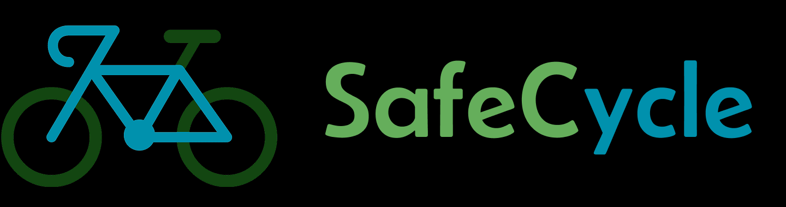
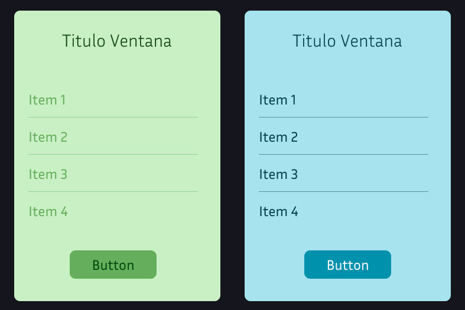
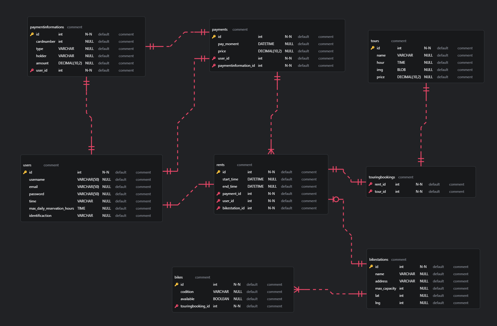
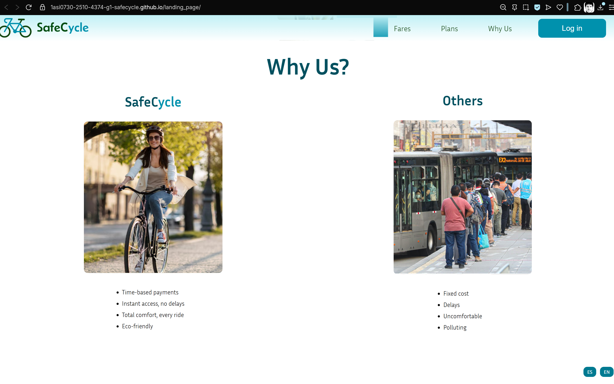

<h1 align="center">
  <strong style="font-size:25px;">Universidad Informe de Trabajo Final</strong>
</h1>

---

<strong>Universidad Peruana de Ciencias Aplicadas</strong>

  

Ingenieria de Software

5to ciclo

---

<strong>Código: </strong>1ASI0730

<strong>Curso:</strong> Aplicaciones Web

<strong>Sección:</strong> 4374

<strong>Docente:</strong> Alberto Wilmer Sanchez Seña

<strong>StartUp: </strong>Cuys TM

<strong>Proyecto:</strong> SafeCycle

## Integrantes:

| Nombres y Apellidos                  | Codigo     |
| ------------------------------------ | ---------- |
| Sanchez Gonzales                     | U202310609 |
| Mora Blas,  Diego Alonzo             | U20231c069 |
| Castañeda Guimas, Giancarlo Santiago | U202310601 |
| Gonzales Valverde, Carlos Matthew  | U202314130 |
| Jonseck Choque, Oliver | U202312912 |

Abril 2025

# Registro de Versiones del Informe

| Versión | Fecha | Autor | Descripción de modificación |
| :---- | :---- | :---- | :---- |
| 1.0 | 01/04/2025 | Sanchez, Mora, Castañeda, Jonseck, Gonzales | Creación del documento Markdown |
| 1.1 | 01/04/2025 | Castañeda | Redacción del startup profile y antecedentes y problemáticas. |
| 1.2 | 02/04/2025 | Sanchez, Mora | Redacción de Lean UX process y preguntas para el diseño de entrevistas |
| 1.3 | 03/04/2025 | Castañeda, Sanchez | Redacción de segmentos objetivos. Redacción de user personas y user task matrix. |

# Project Report Collaboration Insights

## **TP1**

Para el desarrollo de la TP1 nos hemos dividido como equipo diferentes tareas para cada seccion del informe.

| Integrante | Tareas Asignadas |
| :---- | :---- |
| Sanchez Gonzales | Lean UX Problem Statements, Lean UX Hypothesis Statements, Lean UX Canvas, Análisis competitivo, Diseño de entrevistas, User Personas, User Task Matrix, As-is Scenario Mapping, General Style Guidelines, Web Style Guidelines, Landing Page UI Design, Web Applications Wireframes, Web Applications Mock-ups, Web Applications User Flow Diagrams, Sprint Backlog 1, Video About-the-Product |
| Mora Blas, Diego Alonzo | Lean UX Assumptions, Análisis de entrevistas, Epics & User Stories, Impact Mapping, Searching Systems, Navigation Systems, Software Architecture Context Diagram, Software Architecture Components Diagrams, Class Diagrams, Class Dictionary, Aspect Leaders and Collaborators, Development Evidence for Sprint Review, Registro de Entrevista, Evaluaciones según heurísticas |
| Castañeda Guimas, Giancarlo Santiago | Descripción de la Startup, Segmentos objetivo, Registro de entrevistas, Ubiquitous Language, To-Be Scenario Mapping, Software Architecture Context Diagram, Software Development Environment Configuration, Sprint Planning 1 |
| Gonzales Valverde, Carlos Matthew	 | Estrategias y tácticas frente a competidores, Registro de entrevistas, User Journey Mapping, Product Backlog, SEO Tags and Meta Tags, Source Code Management, Software Deployment Configuration, Execution Evidence for Sprint Review. Services Documentation Evidence for Sprint Review, Software Deployment, Evidence for Sprint Review |
| Jonseck Choque, Oliver | Análisis de entrevistas, Empathy Mapping, Epics & User Stories, Organization Systems, Labeling Systems, Web Applications Wireflow Diagrams, Software Architecture Context Diagrams, Software Architecture Container Diagrams, Class Diagrams, Database Diagram, Source Code Style Guide & Conventions, Team Collaboration Insights during Sprint, Conclusiones, Recomendaciones |

# Tabla de contenidos

[Capítulo I: Introducción](#capítulo-i-introducción)
- [Registro de Versiones del Informe](#registro-de-versiones-del-informe)
- [Project Report Collaboration Insights](#project-report-collaboration-insights)
  - [**TP1**](#tp1)
- [Tabla de contenidos](#tabla-de-contenidos)
- [Student Outcome](#student-outcome)
- [Capítulo I: Introducción](#capítulo-i-introducción)
  - [1.1. Startup Profile](#11-startup-profile)
    - [1.1.1. Descripción de la Startup](#111-descripción-de-la-startup)
    - [1.1.2. Perfiles de integrantes del equipo](#112-perfiles-de-integrantes-del-equipo)
      - [1.1.2.1 Gabriel Sánchez Gonzales](#1121-gabriel-sánchez-gonzales)
      - [1.1.2.2 Giancarlo Santiago Castañeda Guimas](#1122-giancarlo-santiago-castañeda-guimas)
      - [1.1.2.3 Diego Alonzo Mora Blas](#1123-diego-alonzo-mora-blas)
      - [1.1.2.4 Gonzales Valverde Carlos Matthew](#1124-gonzales-valverde-carlos-matthew)
      - [1.1.2.5 Oliver Jonseck Choque](#1125-oliver-jonseck-choque)
  - [1.2. Solution Profile](#12-solution-profile)
    - [1.2.1. Antecedentes y problemática](#121-antecedentes-y-problemática)
    - [1.2.2. Lean UX Process](#122-lean-ux-process)
      - [1.2.2.1. Lean UX Problem Statements](#1221-lean-ux-problem-statements)
      - [1.2.2.2. Lean UX Assumptions](#1222-lean-ux-assumptions)
      - [1.2.2.3. Lean UX Hypothesis Statements](#1223-lean-ux-hypothesis-statements)
      - [1.2.2.4. Lean UX Canvas.](#1224-lean-ux-canvas)
  - [1.3 Segmentos objetivo.](#13-segmentos-objetivo)
    - [1.3.1 Segmento objetivo 1: Estudiantes pregrado](#131-segmento-objetivo-1-estudiantes-pregrado)
    - [1.3.2. Segmento Objetivo 2: Turistas](#132-segmento-objetivo-2-turistas)
- [Capítulo II: Requirements Elicitation \& Analysis](#capítulo-ii-requirements-elicitation--analysis)
  - [2.1 Competidores.](#21-competidores)
    - [2.1.1 Análisis competitivo.](#211-análisis-competitivo)
    - [2.1.2 Estrategias y tácticas frente a competidores](#212-estrategias-y-tácticas-frente-a-competidores)
  - [2.2 Entrevistas](#22-entrevistas)
    - [2.2.1 Diseño de entrevistas](#221-diseño-de-entrevistas)
    - [2.2.2 Registro de entrevistas.](#222-registro-de-entrevistas)
    - [2.2.3 Análisis de entrevistas.](#223-análisis-de-entrevistas)
  - [2.3 Needfinding](#23-needfinding)
    - [*Estudiante*:](#estudiante)
    - [*Turista*:](#turista)
  - [2.3.2 User Task Matrix.](#232-user-task-matrix)
  - [2.3.3 User Journey Mapping.](#233-user-journey-mapping)
  - [2.3.4 Empathy Mapping.](#234-empathy-mapping)
    - [2.3.5 As-is Scenario Mapping.](#235-as-is-scenario-mapping)
      - [2.3.5.1. As-is Scenario Mapping para User Persona Estudiante](#2351-as-is-scenario-mapping-para-user-persona-estudiante)
      - [2.3.5.2. As-is Scenario Mapping para User Persona turistas:](#2352-as-is-scenario-mapping-para-user-persona-turistas)
  - [2.4 Ubiquitous Language](#24-ubiquitous-language)
- [estudiante](#estudiante-1)
- [turista](#turista-1)
  - [2.3.5 As-is Scenario Mapping.](#235-as-is-scenario-mapping-1)
  - [2.4 Ubiquitous Language](#24-ubiquitous-language-1)
- [Capítulo III: Requirements Specification](#capítulo-iii-requirements-specification)
  - [3.1 To-Be Scenario Mapping](#31-to-be-scenario-mapping)
    - [3.1.1. To-Be Scenario Mapping para User Persona Estudiante](#311-to-be-scenario-mapping-para-user-persona-estudiante)
    - [3.1.2. To-Be Scenario Mapping para User Persona Turista](#312-to-be-scenario-mapping-para-user-persona-turista)
  - [3.2 Epics \& User Stories](#32-epics--user-stories)
    - [1. Epics](#1-epics)
    - [2. User Stories](#2-user-stories)
  - [3.3 Impact Mapping](#33-impact-mapping)
  - [3.4 Product Backlog](#34-product-backlog)
    - [Product Backlog Tablas](#product-backlog-tablas)
- [Capítulo IV: Product Design](#capítulo-iv-product-design)
  - [4.1. Style Guidelines](#41-style-guidelines)
    - [4.1.1. General Style Guidelines](#411-general-style-guidelines)
    - [4.1.1.1 Colores](#4111-colores)
    - [4.1.1.2 Tipografía](#4112-tipografía)
      - [4.1.1.2.1 Escala](#41121-escala)
      - [4.1.1.2.2 Weights](#41122-weights)
      - [4.1.1.2.3 Nomenclatura](#41123-nomenclatura)
      - [4.1.1.2.4 Ejemplos](#41124-ejemplos)
    - [4.1.1.3 Branding](#4113-branding)
      - [4.1.1.3.1 Claro:](#41131-claro)
      - [4.1.1.3.2 Oscuro:](#41132-oscuro)
    - [4.1.2 Web Style Guidelines](#412-web-style-guidelines)
      - [4.1.2.1 Estilos de letra](#4121-estilos-de-letra)
        - [4.1.2.1.1 Headings](#41211-headings)
        - [4.1.2.1.2 Captions](#41212-captions)
        - [4.1.2.1.3 Forms](#41213-forms)
        - [4.1.2.1.5 Buttons](#41215-buttons)
      - [4.1.2.2 Botones](#4122-botones)
      - [4.1.2.3 Caja de texto](#4123-caja-de-texto)
      - [4.1.2.4 Ventanas desplegables](#4124-ventanas-desplegables)
      - [4.1.2.5 Ventanas Emergentes](#4125-ventanas-emergentes)
  - [4.2. Information Architecture](#42-information-architecture)
    - [4.2.1. Organization Systems](#421-organization-systems)
    - [4.2.2. Labeling Systems](#422-labeling-systems)
    - [4.2.3. SEO Tags and Meta Tags](#423-seo-tags-and-meta-tags)
    - [4.2.4. Searching Systems](#424-searching-systems)
    - [4.2.5. Navigation Systems](#425-navigation-systems)
      - [Páginas Principales](#páginas-principales)
      - [Opciones de Usuario](#opciones-de-usuario)
      - [Búsqueda y Navegación](#búsqueda-y-navegación)
      - [Branding e Identidad](#branding-e-identidad)
  - [4.3. Landing Page UI Design](#43-landing-page-ui-design)
    - [4.3.1. Landing Page Wireframe](#431-landing-page-wireframe)
    - [4.3.2. Landing Page Mock-up](#432-landing-page-mock-up)
  - [4.4. Web Applications UX/UI Design](#44-web-applications-uxui-design)
    - [4.4.1. Web Applications Wireframes](#441-web-applications-wireframes)
    - [4.4.2. Web Applications Wireflow Diagrams](#442-web-applications-wireflow-diagrams)
    - [4.4.3. Web Applications Mock-ups](#443-web-applications-mock-ups)
    - [4.4.4 Web Applications User Flow Diagrams](#444-web-applications-user-flow-diagrams)
  - [4.5. Web Applications Prototyping](#45-web-applications-prototyping)
  - [4.6. Domain-Driven Software Architecture](#46-domain-driven-software-architecture)
    - [4.6.1. Software Architecture Context Diagram](#461-software-architecture-context-diagram)
    - [4.6.2. Software Architecture Container Diagrams](#462-software-architecture-container-diagrams)
    - [4.6.3. Software Architecture Components Diagrams](#463-software-architecture-components-diagrams)
  - [4.7. Software Object-Oriented Design](#47-software-object-oriented-design)
    - [4.7.1. Class Diagrams](#471-class-diagrams)
    - [4.7.2. Class Dictionary](#472-class-dictionary)
  - [4.8. Database Design](#48-database-design)
    - [4.8.1. Database Diagram](#481-database-diagram)
- [Capítulo V: Product Implementation, Validation \& Deployment](#capítulo-v-product-implementation-validation--deployment)
  - [5.1. Software Configuration Management](#51-software-configuration-management)
    - [5.1.1. Software Development Environment Configuration](#511-software-development-environment-configuration)
    - [5.1.2. Source Code Management](#512-source-code-management)
    - [5.1.3. Source Code Style Guide \& Conventions](#513-source-code-style-guide--conventions)
    - [5.1.4. Software Deployment Configuration](#514-software-deployment-configuration)
  - [5.2. Landing Page, Services \& Applications Implementation](#52-landing-page-services--applications-implementation)
    - [5.2.1. Sprint 1](#521-sprint-1)
      - [5.2.1.1. Sprint Planning 1](#5211-sprint-planning-1)
      - [5.2.1.2. Aspect Leaders and Collaborators](#5212-aspect-leaders-and-collaborators)
      - [5.2.1.3. Sprint Backlog 1](#5213-sprint-backlog-1)
      - [5.2.1.4. Development Evidence for Sprint Review](#5214-development-evidence-for-sprint-review)
      - [5.2.1.5. Execution Evidence for Sprint Review](#5215-execution-evidence-for-sprint-review)
      - [5.2.1.6. Services Documentation Evidence for Sprint Review](#5216-services-documentation-evidence-for-sprint-review)
      - [5.2.1.7. Software Deployment Evidence for Sprint Review](#5217-software-deployment-evidence-for-sprint-review)
      - [5.2.1.8. Team Collaboration Insights during Sprint](#5218-team-collaboration-insights-during-sprint)
  - [Conclusiones y recomendaciones](#conclusiones-y-recomendaciones)
  - [Bibliografia](#bibliografia)
  - [Anexos](#anexos)
 
[Capítulo II: Requirements Elicitation & Analysis](#capítulo-ii-requirements-elicitation--analysis)
- [2.1. Competidores](#21-competidores)
  - [2.1.1. Análisis competitivo](#211-análisis-competitivo)
  - [2.1.2. Estrategias y tácticas frente a competidores](#212-estrategias-y-tácticas-frente-a-competidores)
- [2.2. Entrevistas](#22-entrevistas)
  - [2.2.1. Diseño de entrevistas](#221-diseño-de-entrevistas)
  - [2.2.2. Registro de entrevistas](#222-registro-de-entrevistas)
  - [2.2.3. Análisis de entrevistas](#223-análisis-de-entrevistas)
- [2.3. Needfinding](#23-needfinding)
  - [2.3.1. User Personas](#231-user-personas)
  - [2.3.2. User Task Matrix](#232-user-task-matrix)
  - [2.3.3. User Journey Mapping](#233-user-journey-mapping)
  - [2.3.4. Empathy Mapping](#234-empathy-mapping)
  - [2.3.5. As-is Scenario Mapping](#235-as-is-scenario-mapping)
- [2.4. Ubiquitous Language](#24-ubiquitous-language)

[Capítulo III: Requirements Specification](#capítulo-iii-requirements-specification)
- [Registro de Versiones del Informe](#registro-de-versiones-del-informe)
- [Project Report Collaboration Insights](#project-report-collaboration-insights)
  - [**TP1**](#tp1)
- [Tabla de contenidos](#tabla-de-contenidos)
- [Student Outcome](#student-outcome)
- [Capítulo I: Introducción](#capítulo-i-introducción)
  - [1.1. Startup Profile](#11-startup-profile)
    - [1.1.1. Descripción de la Startup](#111-descripción-de-la-startup)
    - [1.1.2. Perfiles de integrantes del equipo](#112-perfiles-de-integrantes-del-equipo)
      - [1.1.2.1 Gabriel Sánchez Gonzales](#1121-gabriel-sánchez-gonzales)
      - [1.1.2.2 Giancarlo Santiago Castañeda Guimas](#1122-giancarlo-santiago-castañeda-guimas)
      - [1.1.2.3 Diego Alonzo Mora Blas](#1123-diego-alonzo-mora-blas)
      - [1.1.2.4 Gonzales Valverde Carlos Matthew](#1124-gonzales-valverde-carlos-matthew)
      - [1.1.2.5 Oliver Jonseck Choque](#1125-oliver-jonseck-choque)
  - [1.2. Solution Profile](#12-solution-profile)
    - [1.2.1. Antecedentes y problemática](#121-antecedentes-y-problemática)
    - [1.2.2. Lean UX Process](#122-lean-ux-process)
      - [1.2.2.1. Lean UX Problem Statements](#1221-lean-ux-problem-statements)
      - [1.2.2.2. Lean UX Assumptions](#1222-lean-ux-assumptions)
      - [1.2.2.3. Lean UX Hypothesis Statements](#1223-lean-ux-hypothesis-statements)
      - [1.2.2.4. Lean UX Canvas.](#1224-lean-ux-canvas)
  - [1.3 Segmentos objetivo.](#13-segmentos-objetivo)
    - [1.3.1 Segmento objetivo 1: Estudiantes pregrado](#131-segmento-objetivo-1-estudiantes-pregrado)
    - [1.3.2. Segmento Objetivo 2: Turistas](#132-segmento-objetivo-2-turistas)
- [Capítulo II: Requirements Elicitation \& Analysis](#capítulo-ii-requirements-elicitation--analysis)
  - [2.1 Competidores.](#21-competidores)
    - [2.1.1 Análisis competitivo.](#211-análisis-competitivo)
    - [2.1.2 Estrategias y tácticas frente a competidores](#212-estrategias-y-tácticas-frente-a-competidores)
  - [2.2 Entrevistas](#22-entrevistas)
    - [2.2.1 Diseño de entrevistas](#221-diseño-de-entrevistas)
    - [2.2.2 Registro de entrevistas.](#222-registro-de-entrevistas)
    - [2.2.3 Análisis de entrevistas.](#223-análisis-de-entrevistas)
  - [2.3 Needfinding](#23-needfinding)
    - [*Estudiante*:](#estudiante)
    - [*Turista*:](#turista)
  - [2.3.2 User Task Matrix.](#232-user-task-matrix)
  - [2.3.3 User Journey Mapping.](#233-user-journey-mapping)
  - [2.3.4 Empathy Mapping.](#234-empathy-mapping)
    - [2.3.5 As-is Scenario Mapping.](#235-as-is-scenario-mapping)
      - [2.3.5.1. As-is Scenario Mapping para User Persona Estudiante](#2351-as-is-scenario-mapping-para-user-persona-estudiante)
      - [2.3.5.2. As-is Scenario Mapping para User Persona turistas:](#2352-as-is-scenario-mapping-para-user-persona-turistas)
  - [2.4 Ubiquitous Language](#24-ubiquitous-language)
- [estudiante](#estudiante-1)
- [turista](#turista-1)
  - [2.3.5 As-is Scenario Mapping.](#235-as-is-scenario-mapping-1)
  - [2.4 Ubiquitous Language](#24-ubiquitous-language-1)
- [Capítulo III: Requirements Specification](#capítulo-iii-requirements-specification)
  - [3.1 To-Be Scenario Mapping](#31-to-be-scenario-mapping)
    - [3.1.1. To-Be Scenario Mapping para User Persona Estudiante](#311-to-be-scenario-mapping-para-user-persona-estudiante)
    - [3.1.2. To-Be Scenario Mapping para User Persona Turista](#312-to-be-scenario-mapping-para-user-persona-turista)
  - [3.2 Epics \& User Stories](#32-epics--user-stories)
    - [1. Epics](#1-epics)
    - [2. User Stories](#2-user-stories)
  - [3.3 Impact Mapping](#33-impact-mapping)
  - [3.4 Product Backlog](#34-product-backlog)
    - [Product Backlog Tablas](#product-backlog-tablas)
- [Capítulo IV: Product Design](#capítulo-iv-product-design)
  - [4.1. Style Guidelines](#41-style-guidelines)
    - [4.1.1. General Style Guidelines](#411-general-style-guidelines)
    - [4.1.1.1 Colores](#4111-colores)
    - [4.1.1.2 Tipografía](#4112-tipografía)
      - [4.1.1.2.1 Escala](#41121-escala)
      - [4.1.1.2.2 Weights](#41122-weights)
      - [4.1.1.2.3 Nomenclatura](#41123-nomenclatura)
      - [4.1.1.2.4 Ejemplos](#41124-ejemplos)
    - [4.1.1.3 Branding](#4113-branding)
      - [4.1.1.3.1 Claro:](#41131-claro)
      - [4.1.1.3.2 Oscuro:](#41132-oscuro)
    - [4.1.2 Web Style Guidelines](#412-web-style-guidelines)
      - [4.1.2.1 Estilos de letra](#4121-estilos-de-letra)
        - [4.1.2.1.1 Headings](#41211-headings)
        - [4.1.2.1.2 Captions](#41212-captions)
        - [4.1.2.1.3 Forms](#41213-forms)
        - [4.1.2.1.5 Buttons](#41215-buttons)
      - [4.1.2.2 Botones](#4122-botones)
      - [4.1.2.3 Caja de texto](#4123-caja-de-texto)
      - [4.1.2.4 Ventanas desplegables](#4124-ventanas-desplegables)
      - [4.1.2.5 Ventanas Emergentes](#4125-ventanas-emergentes)
  - [4.2. Information Architecture](#42-information-architecture)
    - [4.2.1. Organization Systems](#421-organization-systems)
    - [4.2.2. Labeling Systems](#422-labeling-systems)
    - [4.2.3. SEO Tags and Meta Tags](#423-seo-tags-and-meta-tags)
    - [4.2.4. Searching Systems](#424-searching-systems)
    - [4.2.5. Navigation Systems](#425-navigation-systems)
      - [Páginas Principales](#páginas-principales)
      - [Opciones de Usuario](#opciones-de-usuario)
      - [Búsqueda y Navegación](#búsqueda-y-navegación)
      - [Branding e Identidad](#branding-e-identidad)
  - [4.3. Landing Page UI Design](#43-landing-page-ui-design)
    - [4.3.1. Landing Page Wireframe](#431-landing-page-wireframe)
    - [4.3.2. Landing Page Mock-up](#432-landing-page-mock-up)
  - [4.4. Web Applications UX/UI Design](#44-web-applications-uxui-design)
    - [4.4.1. Web Applications Wireframes](#441-web-applications-wireframes)
    - [4.4.2. Web Applications Wireflow Diagrams](#442-web-applications-wireflow-diagrams)
    - [4.4.3. Web Applications Mock-ups](#443-web-applications-mock-ups)
    - [4.4.4 Web Applications User Flow Diagrams](#444-web-applications-user-flow-diagrams)
  - [4.5. Web Applications Prototyping](#45-web-applications-prototyping)
  - [4.6. Domain-Driven Software Architecture](#46-domain-driven-software-architecture)
    - [4.6.1. Software Architecture Context Diagram](#461-software-architecture-context-diagram)
    - [4.6.2. Software Architecture Container Diagrams](#462-software-architecture-container-diagrams)
    - [4.6.3. Software Architecture Components Diagrams](#463-software-architecture-components-diagrams)
  - [4.7. Software Object-Oriented Design](#47-software-object-oriented-design)
    - [4.7.1. Class Diagrams](#471-class-diagrams)
    - [4.7.2. Class Dictionary](#472-class-dictionary)
  - [4.8. Database Design](#48-database-design)
    - [4.8.1. Database Diagram](#481-database-diagram)
- [Capítulo V: Product Implementation, Validation \& Deployment](#capítulo-v-product-implementation-validation--deployment)
  - [5.1. Software Configuration Management](#51-software-configuration-management)
    - [5.1.1. Software Development Environment Configuration](#511-software-development-environment-configuration)
    - [5.1.2. Source Code Management](#512-source-code-management)
    - [5.1.3. Source Code Style Guide \& Conventions](#513-source-code-style-guide--conventions)
    - [5.1.4. Software Deployment Configuration](#514-software-deployment-configuration)
  - [5.2. Landing Page, Services \& Applications Implementation](#52-landing-page-services--applications-implementation)
    - [5.2.1. Sprint 1](#521-sprint-1)
      - [5.2.1.1. Sprint Planning 1](#5211-sprint-planning-1)
      - [5.2.1.2. Aspect Leaders and Collaborators](#5212-aspect-leaders-and-collaborators)
      - [5.2.1.3. Sprint Backlog 1](#5213-sprint-backlog-1)
      - [5.2.1.4. Development Evidence for Sprint Review](#5214-development-evidence-for-sprint-review)
      - [5.2.1.5. Execution Evidence for Sprint Review](#5215-execution-evidence-for-sprint-review)
      - [5.2.1.6. Services Documentation Evidence for Sprint Review](#5216-services-documentation-evidence-for-sprint-review)
      - [5.2.1.7. Software Deployment Evidence for Sprint Review](#5217-software-deployment-evidence-for-sprint-review)
      - [5.2.1.8. Team Collaboration Insights during Sprint](#5218-team-collaboration-insights-during-sprint)
  - [Conclusiones y recomendaciones](#conclusiones-y-recomendaciones)
  - [Bibliografia](#bibliografia)
  - [Anexos](#anexos)
# Student Outcome

| Criterio Especifico | Acciones Realizadas | Conclusiones |
| :---- | :---- | :---- |
| Trabaja en equipo para proporcionar liderazgo en forma conjunta | **Sanchez Gonzales: *TB1*** Dentro de esta entrega me enfoque en avanzar con La redacción del Lean UX Problem Statements, Hypothesis Statements y Canvas. También desarrolle preguntas para el diseño de entrevistas, los user personas y user task matrix. Finalmente, Realice el análisis competitivo, diseño de entrevistas y As-is Scenario Mapping, Style Guidelines, Landing Page UI Design y Web Applications UX/UI Design   **Giancarlo Santiago:*TB1*** ...| Como equipo logramos tener un liderazgo de forma conjunto, puesto que, siempre discutimos acerca de las ideas con el fin de encontrar la mejor solución viable. Todos colaboramos en dar nuestras opiniones e ideas, logrando así un trabajo en conjunto exitoso. |
| Crea un entorno colaborativo e inclusivo, establece metas, planifica tareas y cumple objetivos. | **Sanchez Gonzales: *TB1*** Dentro de esta entrega me enfoque en avanzar con La redacción del Lean UX Problem Statements, Hypothesis Statements y Canvas. También desarrolle preguntas para el diseño de entrevistas, los user personas y user task matrix. Finalmente, Realice el análisis competitivo, diseño de entrevistas y As-is Scenario Mapping, Style Guidelines, Landing Page UI Design y Web Applications UX/UI Design   **Giancarlo Santiago:*TB1*** ...| Como equipo logramos establecernos metas y tareas, creemos que al autoimponerse fechas para terminar de realizar ciertas secciones dentro del capítulo, nos ayudó a planificar y avanzar en conjunto. |

# Capítulo I: Introducción

## 1.1. Startup Profile

### 1.1.1. Descripción de la Startup
Nuestra Startup “Cuys ™” ofrece una aplicación innovadora de préstamos de bicicletas “Safecycle” enfocadas a ayudar a estudiantes y turistas brindando una alternativa sostenible, accesible y segura para llegar a su destino. Ofrecemos una solución independiente al ofrecer las bicicletas como producto principal y contaremos con un modelo de negocio basado en los pagos que se realizarán en la aplicación por el préstamo de las bicicletas. Para ello investigaremos cómo cumplir con esta meta recolectando fuentes sobre modelos de negocios similares y planificamos el diseño y la codificación de nuestra solución.

### 1.1.2. Perfiles de integrantes del equipo

#### 1.1.2.1 Gabriel Sánchez Gonzales

Soy estudiante en la Universidad Peruana de Ciencias Aplicadas (UPC) cursando el 5to ciclo de la carrera de Ingeniería de Software. Soy una persona comprometida con mi desarrollo académico y profesional. Con esa responsabilidad, aspiro a proveer soluciones tecnológicas a aquellos que las requieran para facilitar su área de trabajo. Junto con mi equipo de trabajo tendré la oportunidad de poner mis conocimientos y habilidades en uso con el proyecto “Safecycle” con el fin de disminuir la problemática identificada. 

#### 1.1.2.2 Giancarlo Santiago Castañeda Guimas
Estudiante de la carrera de ingeniería de software en la Universidad Peruana de Ciencias Aplicadas cursando el 5to ciclo. Me considero una persona activa y que siempre busca terminar las cosas bien y de ser posible rápidamente. También me gusta la responsabilidad y el buen ambiente entre mis compañeros de grupo. 

#### 1.1.2.3 Diego Alonzo Mora Blas
Estudiante de la carrera de ingeniería de software en la UPC, cuento con habilidades como el aprendizaje rápido el cual me ha llevado a practicar y conocer diversas áreas como lo son la programación, la ciberseguridad y redes. Tengo el honor de trabajar con mi equipo el cual estoy seguro que nos aseguraremos de presentar un trabajo al nivel.

#### 1.1.2.4 Gonzales Valverde Carlos Matthew
Estudiante de la carrera de ingeniería de software en la Universidad Peruana de Ciencias Aplicadas, me destaco en poder trabajar bajo a presion, tener una
escucha activa y apoyar a mis compañeros cuando mas lo necesiten, esto tambien me ayudo a explorar mas el mundo de la programacion y ahora la ciberseguridad
que quiero especializarme en ello. Agradezco a todo el grupo porque tenemos un ambiente adecuado y estoy seguro que podremos presentar un excelente trabajo.

#### 1.1.2.5 Oliver Jonseck Choque
Estudiante de Ingeniería de Software en la Universidad Peruana de Ciencias Aplicadas, actualmente en el quinto ciclo. Me destaco por ser proactivo y enfocado en cumplir con mis responsabilidades de manera eficiente. Valoro el trabajo bien hecho y disfruto colaborar en entornos donde reina el respeto y la buena comunicación entre compañeros.

## 1.2. Solution Profile

### 1.2.1. Antecedentes y problemática

 1. What? **(¿Cuál es el problema?)**

El problema es que las personas que se movilizan por Lima metropolitana no pueden realizar esta acción con facilidad, un tráfico inmenso en la ciudad. Esto causa que diversos individuos no puedan llegar a sus destinos a tiempo, e ir en vehículos personales cómo automóviles llega a ser muy caro o demanda la misma cantidad de tiempo. Consecuentemente diversas personas tienen que despertarse más temprano o incluso recurrir a utilizar opciones más caras cómo taxis.

 2. When? **(¿Cuándo sucede el problema?)**

Sucede cuando una persona tiene que llegar a un lugar a una hora designada y la gran mayoría de personas salen al mismo tiempo, generando una congestión, una ocurrencia muy común hoy en día vista en el país. Según un estudio realizado por la Asociación Automotriz del Perú en 2024, Lima es la ciudad con mayor congestión vehicular en América Latina.

 3. Where? **(¿Dónde surge el problema?)**

Surge en Lima metropolitana por zonas de alta concurrencia vehicular cómo calles principales, mercados, centros educativos y centros turísticos.

4. Who?  **(¿Quiénes están involucrados?)**

Los principales afectados son los habitantes y la gente que se traslada por Lima Metropolitana. Por ejemplo, los estudiantes, trabajadores y turistas.

5. Why **(¿Por qué ocurre el problema?)**

El problema ocurre debido a una estructura de transporte que no pudo evolucionar al mismo ritmo del aumento de necesidades de las personas. La baja cobertura del transporte público y alta urgencia que genera no logra cubrir la demanda de forma eficiente, obligando al uso de transporte particular, empeorando así la congestión vehicular, que en consecuencia termina en personas no llegando a tiempo a ciertos eventos o lugares e incluso con fatiga y molestia.

6. How **(¿Cómo se lleva a cabo el problema?)**

El problema se lleva a cabo cuando miles de personas en Lima metropolitana intentan movilizarse a una hora popular por vías congestionadas, generando embotellamientos y rutas vehiculares saturadas. La falta de un transporte accesible y económico incentiva a esta problemática, puesto que la gente que se traslada por Lima tiene que elegir entre un transporte público como son los buses o uno particular y poco económico como son los taxis o carros

7. How much **(¿Cuál es la magnitud del problema?)**

Medimos la magnitud del problema a través de entrevistas realizadas a un público de 30 personas que transitan diariamente en Lima Metropolitana

[Link a encuesta enviada](https://docs.google.com/forms/d/e/1FAIpQLSeA6pLs-rQHjfQKjtP-qf2gnkVFpHTSa95WKuD-IgsjbufGUw/viewform?usp=dialog)

[Link a resultados de encuesta](https://docs.google.com/spreadsheets/d/1tCFJkLHdxL313atSLzJCLOHC-6f2ujesVNoaYFEerGg/edit?usp=sharing)

Gracias a las encuestas realizadas se observó que un 86.7% no cuenta con un transporte fijo de transporte, un 63.3% cree que siempre tiene retrasos por el tráfico, un 93.3% se sentiría cómodo con el uso de una bicicleta como medio de transporte segura, económica y fácil de usar. Además, cuentan con una preferencia hacia los precios accesibles y seguridad de servicio en un 96.7% y 90% respectivamente. Finalmente el 80% de los encuestados piensan que una aplicación de alquiler de bicicletas les ayudaría a moverse mejor alrededor de la ciudad. Con esto podemos concluir que en efecto esta problemática es verdadera y concurrente dentro de Lima Metropolitana. La demanda es clara: los usuarios necesitan una alternativa confiable, segura y eficiente frente al actual caos del transporte urbano.

### 1.2.2. Lean UX Process

#### 1.2.2.1. Lean UX Problem Statements
Nuestra solución busca proveer un aplicativo que conecte a los estudiantes y turistas que no tengan un método de traslado fijo  con un medio de transporte eco amigable, rápido y accesible, como lo es la bicicleta, con el fin de que puedan desplazarse de un lugar a otro a través de esta misma. Asimismo, al garantizar la seguridad de los usuarios de estas bicicletas a través de bloqueos en casos un uso excesivo o por bloqueo del propio rentador, evitamos posibles robos y mal usos de las bicicletas.
Hemos observado que al no tener un transporte fijo tanto los estudiantes como turistas no pueden llegar a sus destinos propuestos a tiempo. El tráfico en Lima metropolitana y el acumulamiento de gente dentro de servicios de transporte público hacen la tarea de desplazamiento casi imposible, y tanto los estudiantes como los turistas no tienen una necesidad para comprarse un transporte personal para poder movilizarse. 
¿Cómo podemos ofrecer un transporte fiable y organizado, que los ayude a llegar a su destino?
Notamos que los estudiantes y turistas no desean pagar por un medio de transporte como son los taxis, puesto que las tarifas pueden llegar a exceder su presupuesto, pero tampoco se sienten cómodos al usar el transporte público, pues este es muy incomodo o los deja con mucha caminata hacia su destino final lo que termina generando una pérdida de tiempo. Esto repercusiona en que no pueden llegar a los destinos que desean a tiempo y terminan gastando más tiempo en el recorrido que en el propio lugar.
¿Cómo puede nuestra plataforma proveer a nuestro público con una manera más eficiente de transporte y movilización?

#### 1.2.2.2. Lean UX Assumptions

Creemos que los estudiantes y turistas en Lima enfrentan una falta de transporte fiable y económico, lo que genera retrasos e incomodidad, al ofrecer bicicletas accesibles mediante una app, creemos firmemente que  resolveremos esta necesidad. Nuestros segmentos objetivos priorizan el ahorro, prefiriendo nuestro servicio frente a taxis o transporte público costoso,además percibirán las bicicletas como una opción más cómoda al evitar el tráfico.La seguridad será clave, por lo que el sistema de bloqueo automático reducirá el miedo a robos, aumentando la confianza. Asumimos que la app será adoptada fácilmente ya que es intuitiva y garantiza transacciones seguras. 

#### 1.2.2.3. Lean UX Hypothesis Statements
Creemos que la eficacia con la que se movilizan los estudiantes y turistas aumentaría en un 80% debido a que se les proporcionará con una herramienta de transporte de acceso libre , como son las bicicletas, a través de un pago mínimo. Sabremos que estamos en lo correcto cuando se visualice un aumento de puntualidad hacia ciertos eventos.
Creemos que los estudiantes y turistas podrán viajar más cómodamente hacia sus destinos, proporcionándoles una mejor experiencia en general. Sabremos que estamos en lo correcto cuando a través de encuestas a usuarios se menciona seguidamente que la comodidad de sus viajes ha mejorado, concluyendo con más de un 70% de aprobación en cuanto a comodidad.
Creemos que nuestro servicio será 30% más económico que otros medios de transporte de la ciudad para los estudiantes y turistas. Sabremos que estamos en lo correcto al comparar la media de dinero que gastaban antes los usuarios en comparación con lo que gastan usando nuestro servicio.
Creemos que la implementación de este sistema de préstamo de bicicletas puede reducir hasta un 20% la congestión vehicular que se presencia en zonas de rutas universitarias y rutas turísticas. Sabremos que estamos en lo correcto cuando se visualice un cambio en las paradas de transporte público, mostrando que más personas pueden entrar en los buses y menos personas recurren a los taxis.
Creemos que los usuarios se sentirán más seguros usando las bicicletas sabiendo que estas tienen un sistema de bloqueo automático que solo se activa solo cuando el tiempo de préstamo se sobrepasa o si la bicicleta es reportada como robada. Sabremos que estamos en lo correcto a través de entrevistas a los usuarios acerca de la confianza que le tienen a las bicicletas.

#### 1.2.2.4. Lean UX Canvas.

| Business Problem | Solution Ideas | Business Outcomes |
| :---- | :---- | :---- |
| Nuestra solución busca proveer un aplicativo que conecte a los estudiantes y turistas que no tengan un método de traslado fijo  con un medio de transporte eco amigable, rápido y accesible, como lo es la bicicleta, con el fin de que puedan desplazarse de un lugar a otro a través de esta misma. Asimismo, al garantizar la seguridad de los usuarios de estas bicicletas a través de bloqueos en casos un uso excesivo o por bloqueo del propio rentador, evitamos posibles robos y mal usos de las bicicletas. Hemos observado que al no tener un transporte fijo tanto los estudiantes como turistas no pueden llegar a sus destinos propuestos a tiempo. El tráfico en Lima metropolitana y el acumulamiento de gente dentro de servicios de transporte público hacen la tarea de desplazamiento casi imposible. Además, tanto los estudiantes como los turistas no tienen la necesidad de comprarse un transporte personal para poder movilizarse.  ¿Cómo podemos ofrecer un transporte fiable y organizado, que los ayude a llegar a su destino? Notamos que los estudiantes y turistas no desean pagar por un medio de transporte como son los taxis, puesto que las tarifas pueden llegar a exceder su presupuesto, pero tampoco se sienten cómodos al usar el transporte público, pues este es muy incomodo o los deja aun con mucha caminata hacia su destino, generando una pérdida de tiempo. Esto repercusiona en que no pueden llegar a los destinos que desean de forma puntual y terminan gastando más tiempo en el recorrido que en el propio lugar. ¿Cómo puede nuestra plataforma proveer a nuestro público con una manera más eficiente de transporte y movilización? | Brindar un préstamo de bicicleta para que los estudiantes o turistas puedan movilizarse por un costo. Integrar un sistema de bloqueo automático para evitar un mal uso de las bicicletas. Contar con un sistema de recojo y devolución a través de diferentes estaciones | Los estudiantes usarán más nuestra plataforma que el transporte público habitual en un 30%. Control adecuado a las bicicletas gracias a su sistema de seguridad, reduciendo en un 20% de probabilidades de mal uso Retención de usuarios en un 50% después del primer mes Aumento de visibilidad de la plataforma en un 40% por los usuarios que la comparten |
| Hypothesis | Users & Customers | User Benefits |
| Creemos que la eficacia con la que se movilizan los estudiantes y turistas aumentaría en un 80% debido a que se les proporcionará con una herramienta de transporte de acceso libre, como son las bicicletas, a través de un pago mínimo. Sabremos que estamos en lo correcto cuando se visualice un aumento de puntualidad hacia ciertos eventos. Creemos que los estudiantes y turistas podrán viajar más cómodamente hacia sus destinos, proporcionándoles una mejor experiencia en general. Sabremos que estamos en lo correcto cuando a través de encuestas a usuarios se menciona seguidamente que la comodidad de sus viajes ha mejorado, concluyendo con más de un 70% de aprobación en cuanto a comodidad. Creemos que nuestro servicio será 30% más económico que otros medios de transporte de la ciudad para los estudiantes y turistas. Sabremos que estamos en lo correcto al comparar la media de dinero que gastaban antes los usuarios en comparación con lo que gastan usando nuestro servicio. Creemos que la implementación de este sistema de préstamo de bicicletas puede reducir hasta un 20% la congestión vehicular que se presencia en zonas de rutas universitarias y rutas turísticas. Sabremos que estamos en lo correcto cuando se visualice un cambio en las paradas de transporte público, mostrando que más personas pueden entrar en los buses y menos personas recurren a los taxis. Creemos que los usuarios se sentirán más seguros usando las bicicletas sabiendo que estas tienen un sistema de bloqueo automático que solo se activa solo cuando el tiempo de préstamo se sobrepasa o si la bicicleta es reportada como robada. Sabremos que estamos en lo correcto a través de entrevistas a los usuarios acerca de la confianza que le tienen a las bicicletas. | Estudiantes universitarios de pregrado que deseen llegar a su destino rápidamente y evitar el tráfico. Turistas que requieran un transporte personal temporal sin la necesidad de rentar un automóvil. | Tener acceso a un transporte personal económico, amigable con el medio ambiente y disponible en cualquier momento Movilizarse rápida y eficazmente alrededor de la ciudad. Llegar más puntuales a diferentes eventos o lugares, proporcionando un mayor tiempo en el lugar y menos tiempo de movilización. Reducir sus gastos de transporte gracias a su precio accesible. Contribuir a una mejora en el medio ambiente al usar un medio de transporte ecoamigable  |
|  | What’s the most important thing we need to learn first?  | What’s the least amount of work we need to learn the next most important thing?    |
|  | Determinar si los estudiantes y turistas están dispuestos a pagar por el servicio propuesto. Verificar que los usuarios de estas bicicletas no les den un mal uso a las mismas. | Diseñar entrevista con preguntas concretas a una estadística Desplegar una versión de prueba con pocas bicicletas en puntos estratégicos para detectar posibles problemas iniciales |

## 1.3 Segmentos objetivo.
### 1.3.1 Segmento objetivo 1: Estudiantes pregrado
**Descripción:** 
Los estudiantes tienen una vida agitada, una rutina dinámica y ajustada a horarios específicos. Por las mañanas muchos deben desplazarse desde sus residencias hacia sus centros de educación en poco tiempo, además del agobiante tráfico y algunos teniendo que lidiar con el transporte público.
**Caracteristicas:**
- Edad: 18 a 30 años 
- Ubicación: Zonas urbanas, suelen vivir cerca de sus centros de educación 
- Nivel socioeconomico: Clase Media	    
### 1.3.2. Segmento Objetivo 2: Turistas
**Descripción:** 
Los turistas buscan maximizar su tiempo explorando nuevas partes de la ciudad de una manera cómoda y accesible, ya sean centros turísticos como museos, atracciones o centros históricos. Para ello requiere gastar e invertir un buen capital, además considerando el tráfico en el Perú esto no puede ser tanto del agrado del turista. 
**Caracteristicas:**
- Edad: 18 a 50 años 
- Ubicación: Zonas urbanas con alto índice de turismo, puntos de intereses históricos o culturales
- Nivel socioeconomico: Clase Media - Alta

# Capítulo II: Requirements Elicitation & Analysis
## 2.1 Competidores.
### 2.1.1 Análisis competitivo.

| **Competitive Analysis Landscape** | **Escriba en el recuadro la pregunta que busca responder o el objetivo de este análisis.** |
| :---- | :---- |
| ¿Por qué llevar a cabo este análisis?  | Deseamos analizar a nuestros competidores para buscar en qué puntos podemos mejorar, contra que nos estamos enfrentando en el mercado y como nos distinguimos de estos |

|  |  |   Safecycle |  CityBikeLima |  Barrancobikes |  Mirabiciperu |
| :---- | :---- | ----- | :---- | :---- | :---- |
| Perfil | Overview Ventaja competitiva  | Plataforma direccionada hacia la renta por minuto de las bicicletas, las cuales se pueden reservar desde la aplicación y posteriormente. | Servicio presencial en el cual se rentan bicicletas por un tiempo de 30 minutos gratis a través de pases mensuales, anuales o diarios y pagados por la pantalla de la bicicleta. | Una plataforma en la que puedes pagar por una bicicleta por horas, días o semanas alrededor de Barranco | Plataforma que ofrece una reservas de bicicletas a través de rutas turísticas |
|  | ¿Qué valor ofrece a los clientes? | • Devolución de bicicletas en cualquier estación.  • Cobro por minuto.  • Seguro automatico.  • Paquetes de descuento a estudiantes | • Tarjeta con pases anuales  • Desbloqueo de bicicleta con código o tarjeta  • Devolución de bicicletas en cualquier estación.  • Servicio de pausa de la bicicleta | • Renta de bicicletas por horas, días y semanas  • Proporciona elementos de seguridad Delivery de bicicleta | • 3 rutas de turismo   • Ofrece una renta de bicicleta por duración de tour  |
| Perfil de Marketing | Mercado objetivo  | • Estudiantes de pregrado  • Turistas | • Residentes de San Isidro | • Residentes de Barranco Turistas | • Turistas |
|  | Estrategias de marketing | •Descuentos hacia los estudiantes  • Touring | • Registro a través de pases y tarjetas 30 primeros minutos gratis  • Tutoriales acerca de uso | • Añade un descuento de consumo a un restaurante afiliado | • Tours en grupo  • Opiniones de otros usuario en la misma página web |
| Perfil de Producto | • Productos & Servicios  | • Renta de Bicicleta | • Tarjeta de pago para bici  • Renta de Bicicleta | • Casco y cadena incluido con la renta  • Renta de Bicicleta | • Tours en zonas culturales, con explicación en bicicleta  • Servicios técnico y de repuesto |
|  | Precios & Costos  | • **Estudiantes:**  S/. 0.035 / minuto  • **Tarifa General:**  S/. 0.045 / minuto  • **Tarifa Inicial:**  S/. 1.00 / minuto | • **Minuto 0 al 30:** Sin costo  •**31 al 120:**  S/ 2.00 cada 30 minutos o fracción  • **121 a más:**  S/ 7.00 cada hora o fracción | • **02 horas:**  S/. 25.00  • **03 horas:**  S/ 30.00  • **05 horas:**  S/ 45.00  • **Más de 05 horas:**  S/ 55.00 | • **Ruta 1:** USD 35 S/. 133  • **Ruta 2:** USD 25 S/. 95  • **Ruta 3:** USD 35 S/. 133 |
|  | Canales de distribución (Web y/o Móvil)  | Web y Móvil | Presencial Web y Móvil | Web | Web |
| Análisis SWOT | Fortalezas | • Tarifa accessible  • Adaptable a otros dispositivos | Diferentes formas de renta  • Prueba gratuita para atraer clientes  •  Tarifa accessible | • Delivery a la puerta de tu casa  • Elementos extra proporcionados  | • Tours con guia turistico.  • Función para rentar en grupo |
|  | Debilidades | • Dependencia a internet  •Dependencia a disponibilidad   •Riesgo de vandalismo  • Bajo conocimiento de marca inicial. | • Riesgo de vandalismo  • Dificultad de uso para personas sin mucho conocimiento tecnológico  • Reubicación de bicicletas por congestión | • Dependencia a disponibilidad Bajo conocimiento de marca inicial. | • Dependencia a disponibilidad  • Falta de confianza de usuario |
|  | Oportunidades | • Alianzas con centros educativos o cadenas de turismo  • Subvención gubernamental por negocio eco-friendly  • Incorporar nuevos tipos de transporte | • Incorporar nuevos tipos de transporte  • Expansión de distritos disponibles | • Expansión de distritos disponibles | • Mayor cantidad de tours disponibles  • Alianza con hoteles |
|  | Amenazas | • Competencia en el mercado alta • Robo o hackeos | • Problemas por clima o infraestructura | • Quejas por demora de renta | • Cambios de normativas de rutas  • Poca retención de usuarios |

### 2.1.2 Estrategias y tácticas frente a competidores
Después de revisar lo que ofrecen otras plataformas, y considerando el análisis SWOT que hicimos, nos dimos cuenta de que hay cosas que podemos hacer diferentes y mejor. Aunque ya estemos implementando algunas, hay otras que podemos incluir para sobre salir entre nuestros competidores.

**Estrategias**

**Experiencia del cliente**

Esto lo podemos lograr al ofrecer un servicio más fácil y accesible que otros, ya sean utilizar una forma de pago mucho más fácil e intuitiva, ofrecer un servicio mejor en teoría para el cliente dándoles mayor libertad al escoger su servicio y/o ofreciendo bicicletas de mejor calidad para el cliente promedio. En el caso de nuestro segmento objetivo, los estudiantes pueden obtener un descuento al momento de alquilar, además de poseer almacenes en zonas donde estos frecuentan por sus estudios y en el caso de los turistas ofrecemos una aplicación que se encuentra en otros idiomas (principalmente inglés), un sistema de pago que se ajusta a medios de pagos más internacionales, una forma rápida de iniciar sesión, independientemente de donde provienen y ofreciendo una opción de recorrer rutas predeterminadas para incentivar el turismo en la ciudad.

**Diferenciación de la competencia**

Nos diferenciamos de otros servicios principalmente por que ofrecemos bicicletas con GPS y un freno automatico incluido, lo que da una mayor sensación de seguridad al cliente; rutas personalizadas para ofrecer un turismo de mayor calidad por la ciudad, con una asistencia incluida por el celular; la posibilidad de reservar bicicletas; no hay necesidad de pagar una membresía; alquiler rápido e inmediato de una bicicleta y mayor libertad al momento de alquilar una bicicleta.

**Precios más vistosos**

Los precios que se muestran en la aplicación están puestos con la idea de aparentar ser más baratos (se encuentran cómo centavos por minuto en vez de soles por hora), esto permite que el cliente sienta que tenga un mayor control sobre lo que paga a diferencia de nuestros competidores que cobran por hora (Barrancobikes), con una membresía (Citybike Lima) o exclusivamente con una reserva (mirabici).

**Alquiler y reserva más rápida que otros**

Ofrecemos además una manera para alquilar y/o reserva mucho más fácil que otros con una interfaz fácil de usar, diferentes maneras de pagos, más idiomas y un sistema de avisos que ayuda al cliente.

**Tácticas**

**Mejores bicicletas**

Las bicicletas se promocionan cómo más seguras, con un GPS incluido, cómodas y de último modelo, para esto se observan las bicicletas de los competidores y la calidad en la cual se encuentran.

**Mejor digitalización**

Se implementará un seguimiento por medio de Google maps con mejor precisión y un seguimiento a la bicicleta que permitirá saber dónde esta localizado. Además, que tendremos un sitio web claro dónde el cliente sabrá guiarse. Finalmente, después de una determinada cantidad de viajes se le preguntara al cliente si quisiera dejar una reseña (Mostraremos principalmente las reseñas con 4 de 5 estrellas o más en la página principal).

**Un servicio que evoluciona**

Ofreceremos más rutas con el paso del tiempo e incluiremos más medios de pago para facilitar el proceso, además de buscar maneras de ofrecer descuentos a los clientes. Y cómo idea a futuro principal, podremos realizar alianzas con otras empresas cómo “Yape” para ofrecer descuentos desde su aplicación o con empresas de viajes para que turistas tengan bicicletas ya reservadas.
## 2.2 Entrevistas
### 2.2.1 Diseño de entrevistas
Como se mencionó anteriormente, nuestros segmentos objetivos están conformados por estudiantes universitarios de pregrado, principalmente aquellos que viven en cercanías de la universidad y turistas.

Después de solicitarles sus datos personales básicos como nombres, apellidos, edad y distrito de estadía, se les preguntará lo siguiente a los entrevistados.

**Preguntas a realizar:**

**Generales:**

¿Cuál es tu nombre y apellidos?

¿Cuántos años tienes?

¿Cuál es tu lugar de nacimiento?

¿Cómo te transportas habitualmente en tu día a día?

¿Cuánto tiempo te demora normalmente para llegar a tu destino?

¿Has usado bicicletas anteriormente como medio de transporte antes? ¿Cuál fue la razón?

¿Cuánto estarías dispuesto a pagar por un minuto de alquiler?

**Estudiantes:**

¿Cuáles son los horarios que consideras más críticos en términos de congestión en el transporte?

¿Qué problemas enfrentas al usar el transporte público o privado como estudiante?

¿Te ha afectado el costo del transporte?

¿Has usado bicicletas anteriormente para movilizarte al campus o a otro entorno?

¿Qué elementos valoras más en un sistema de préstamo de bicicletas?

¿Te sentirías cómodo usando una app para reservar, desbloquear y pagar por la bicicleta?

¿Qué medidas de seguridad te harían confiar en el servicio?

¿Qué te haría dejar de usar el servicio?

**Turistas:**

¿Has usado bicicletas como turista en otras ciudades? ¿Qué te gustó o incomodó?

¿Te interesaría conocer la ciudad en bicicleta? ¿Por qué sí o por qué no?

¿Consideras que explorar la ciudad en bicicleta te conecta más con su historia, costumbres y cultura?

¿Te gustaría contar con rutas recomendadas o tours autoguiados en la app?

¿Qué aspectos valoras más en un servicio de alquiler de bicicletas como turista?

¿Qué factores te harían sentir seguro usando una bicicleta en una ciudad que no conoces?

### 2.2.2 Registro de entrevistas.

| Segmento Objetivo | Estudiantes |
| ----- | ----- |
| **Número de registro** | **Datos del entrevistado** |
| 01 | **Nombre:** Masaru Nikaido  **Edad:** 19  **Profesión:** Estudiante Universitario **Distrito:** San Borja  **Inicio \- Duración:** 0:00 \- 9:39  **Enlace de la entrevista: [upc-pre-202510-1asi0730-4374-SafeCycle-needfinding-sprint-1.mp4](https://upcedupe-my.sharepoint.com/:v:/g/personal/u202310601_upc_edu_pe/EcOxX6OmbxpItmVcMZ6kNuABqCHsXueskZbc_v41cdhhvA?nav=eyJyZWZlcnJhbEluZm8iOnsicmVmZXJyYWxBcHAiOiJTdHJlYW1XZWJBcHAiLCJyZWZlcnJhbFZpZXciOiJTaGFyZURpYWxvZy1MaW5rIiwicmVmZXJyYWxBcHBQbGF0Zm9ybSI6IldlYiIsInJlZmVycmFsTW9kZSI6InZpZXcifX0%3D&e=PnFjdS)** |
|  | **Resumen:** Primero nos cuenta que tiene varias opciones a la hora de elegir su transporte, con las cuales aproximadamente se demora entre 20 y 1 hora en llegar a su destino. Nos cuenta que uso la bicicleta en manera de hacer ejercicio y de manera recreativa más que todo, además nos cuenta que sus principales dificultades al momento de transportarse es el tráfico.En cuanto a nuestra aplicación, menciona que es una buena idea al tratarse de una alternativa ecológica y barata comparado a otros competidores y lo consideraría si en un futuro existieran.  |
| 02 | **Nombre:** Sebastian Rubio  **Edad:** 19  **Profesión:** Estudiante Universitario  **Distrito:** San Juan de Miraflores  **Inicio \- Duración:** 0:00 \- 3:43  **Enlace de la entrevista: [upc-pre-202510-1asi0730-4374-SafeCycle-needfinding-sprint-2.mp4](https://upcedupe-my.sharepoint.com/:v:/g/personal/u202310601_upc_edu_pe/EQd4AujSIvlInuhHyasyfWYBMIkFCk0shg9DGG3WWEIpAA?nav=eyJyZWZlcnJhbEluZm8iOnsicmVmZXJyYWxBcHAiOiJTdHJlYW1XZWJBcHAiLCJyZWZlcnJhbFZpZXciOiJTaGFyZURpYWxvZy1MaW5rIiwicmVmZXJyYWxBcHBQbGF0Zm9ybSI6IldlYiIsInJlZmVycmFsTW9kZSI6InZpZXcifX0%3D&e=RAWBH1)** |
|  | **Resumen:** Al comenzar la entrevista se le hace la pregunta como se suele movilizar a lo que él responde que en auto, por lo cual normalmente y sin trafico suele trasladarse a su destino entre 15 a 30 minutos. Nos cuenta que ademas del trafico, sus dificultades al transportarse por la ciudad es por la forma de las carreteras al no poder girar hacia un lado, cometes un error y no hay mucho que hacer. Ademas nos cuenta que ya habia visto una idea similar a la nuestra y si le interesaria utilizarla en algun momento como una alternativa a su transporte actual|
| 03 | **Nombre:**  Daniel Rodriguez  **Edad:** 19  **Profesión:** Estudiante Universitario  **Distrito:** Santiago de Surco  **Inicio \- Duración:** 0:00 \- 5:25  **Enlace de la entrevista: [upc-pre-202510-1asi0730-4374-SafeCycle-needfinding-sprint-3.mkv](https://upcedupe-my.sharepoint.com/:v:/g/personal/u202314130_upc_edu_pe/EUDq_N85FKJPguTrCVUShpQB9PNvLjD0-WIlv3Yfii5hrw?e=psjhMf&nav=eyJyZWZlcnJhbEluZm8iOnsicmVmZXJyYWxBcHAiOiJTdHJlYW1XZWJBcHAiLCJyZWZlcnJhbFZpZXciOiJTaGFyZURpYWxvZy1MaW5rIiwicmVmZXJyYWxBcHBQbGF0Zm9ybSI6IldlYiIsInJlZmVycmFsTW9kZSI6InZpZXcifX0%3D)** |
|  | **Resumen:** Daniel nos cuenta que tiene carro y se moviliza a todas partes con eso, suele demorar entre 20 a 25 minutos algunas veces un poco más por el tráfico. Nos dice que si ha usado bicicletas anteriormente, pero mayormente cuando salía a pasear como un método de recreación. Uno de los problemas principales que tiene al moverse por la ciudad sería el tráfico. Le interesa mucho nuestra aplicación ya que lo podría necesitar para tramos cortos que no necesiten carro y pueda llegar a tiempo a su destino sin tráfico y ahorrando en gasolina|
| **Segmento Objetivo** | **Turistas** |
| **04** | **Nombre:** Juan Diego Sersen  **Edad:** 19  **Profesión:** Estudiante Universitario  **Distrito:** Santiago de Surco  **Inicio \- Duración:** 0:00 \- 4:09  **Enlace de la entrevista: [upc-pre-202510-1asi0730-4374-SafeCycle-needfinding-sprint-4.mp4](https://upcedupe-my.sharepoint.com/:v:/g/personal/u202310601_upc_edu_pe/EfH2XZKty3hAiBMtzeb_1xIBqQMj-Dk_sWxMviE1jYbEbw?nav=eyJyZWZlcnJhbEluZm8iOnsicmVmZXJyYWxBcHAiOiJTdHJlYW1XZWJBcHAiLCJyZWZlcnJhbFZpZXciOiJTaGFyZURpYWxvZy1MaW5rIiwicmVmZXJyYWxBcHBQbGF0Zm9ybSI6IldlYiIsInJlZmVycmFsTW9kZSI6InZpZXcifX0%3D&e=ZHaPZz)** |
|  | **Resumen:** Se menciona que se tarda en llegar media hora hacia su destino, luego nos menciona que se suele transportar mucho en bicicleta, de hecho nos cuenta que en uno de sus viajes a Paises Bajos se dio cuenta que varias personas usaban la bicicleta como medio de transporte mucho mas que los autos asi que el tambien tuvo que acostumbrarse. También al mencionarle de un precio aproximado para que utilice nuestra aplicación seria de 3 a 5 soles y tambien le pareceria genial que hubiera una sección de ratings y comentarios para saber que opina la gente sobre nuestra aplicación, finalmente comentó que le pareceria buena idea implementar nuestra app en el país. |
| **05** | **Nombre:** Santiago Valdivia  **Edad:** 19  **Profesión:** Estudiante Universitario  **Distrito:** Santiago de Surco  **Inicio \- Duración:** 0:00 \- 5:54  **Enlace de la entrevista: [upc-pre-202510-1asi0730-4374-SafeCycle-needfinding-sprint-5.mp4](https://upcedupe-my.sharepoint.com/:v:/g/personal/u202310601_upc_edu_pe/ETy_uxrs0lBEmGXAC30yeSABog1SBjRfHgrf7HY2tj_0FQ?nav=eyJyZWZlcnJhbEluZm8iOnsicmVmZXJyYWxBcHAiOiJTdHJlYW1XZWJBcHAiLCJyZWZlcnJhbFZpZXciOiJTaGFyZURpYWxvZy1MaW5rIiwicmVmZXJyYWxBcHBQbGF0Zm9ybSI6IldlYiIsInJlZmVycmFsTW9kZSI6InZpZXcifX0%3D&e=dzUUdL)** |
|  | **Resumen:** Nos comenta que se suele transportar por la linea 1 del metro o en algunos casos usa el metropolitano y aproximadamente se demora en llegar entre 20 minutos y en casos mas extremos 1 hora a su destino. Usaba bicicleta de manera recreativa y ademas cuenta que su mayor dificultad a la hora de movilizarse es el trafico cuando usa el metropolitano. Al momento de preguntarle sobre el transporte mas comodo que ha usado nos habla cuando estaba en Argentina y utilizaba el Subterraneo mas que todo por las conexiones que cuenta este, donde se puede movilizar a todos los lugares del país, ademas nos comenta de un servicio parecido al nuestro el cual se encuentra en los bosques de Palermo, donde puedes pedir una bicicleta rentada y usarla por cuanto tiempo quieras. Al momento de consultarle sobre si podria parecerle buena idea implementar acá en Perú dijo que si pero tendria que ser en lugar mas urbanos como Miraflores y que le pareceria interesante llegar a usarlo.  |
|**06**| **Nombre:** Itzel Vargas  **Edad:** 19  **Profesión:** Estudiante de intercambio  **Distrito:** Miraflores **Inicio \- Duración:** 0:00 \- 3:29  **Enlace de la entrevista: [upc-pre-202510-1asi0730-4374-SafeCycle-needfinding-sprint-6.mp4](https://upcedupe-my.sharepoint.com/:v:/g/personal/u202314130_upc_edu_pe/EdCz9Fn0fiJBvEnPg0Wn3twBMvRQOLy0TFGBnsse_tpMmg?e=kgHNIZ&nav=eyJyZWZlcnJhbEluZm8iOnsicmVmZXJyYWxBcHAiOiJTdHJlYW1XZWJBcHAiLCJyZWZlcnJhbFZpZXciOiJTaGFyZURpYWxvZy1MaW5rIiwicmVmZXJyYWxBcHBQbGF0Zm9ybSI6IldlYiIsInJlZmVycmFsTW9kZSI6InZpZXcifX0%3D)** |
|  | **Resumen:** Nos comenta que se mueve en taxi normalmente por aplicativos, se suele tardar entre 40 minutos. Si usa bicicletas ya que suele movilizarse así en su ciudad La Paz lo ve algo muy práctico. También comenta que en Perú más que todo en la capital(Lima) hay mucho tráfico. En escala del 1 al 5 pone un 4 ya que si estaría dispuesta a usar un servicio de préstamo de bicicletas más que todo si cuenta con estaciones bien ubicadas. Entre la semana gasta 100 a 150 soles. |
### 2.2.3 Análisis de entrevistas.
Los entrevistados demostraron usar diversos tipos de transporte para movilizarse por la ciudad, incluyendo su propio carro, otros usan transporte publico como el metro o el metropolitano, y en algunos casos, la bicicleta, aunque esta última se emplea más comúnmente con fines recreativos o de ejercicio. Un patrón recurrente en las respuestas es que el tráfico representa una de las principales dificultades, lo cual es algo que consideramos obvio al vivir en un país con la peor estadistica en terminos de trafico y conductores en toda sudamerica, esto genera demoras a la mayoria de los entrevistados entre 20 minutos y 1 hora para llegar a sus destinos. Ademas, algunos participantes mencionan problemas con la infraestructura vial, como la dificultad para moverse libremente o tomar rutas.

En cuanto a la percepción de la aplicación propuesta, los entrevistados coinciden en que representa una alternativa ecologica, economica y atractiva frente a los metodos de transporte convencionables. Aunque algunos entrevistados del segmento turistas mencionan que hay propuestas similares en otras partes del mundo, como en los Países Bajos o en Palermo (Argentina), todos expresan interés en que una solución de este tipo se implemente en nuestro país, y de preferencia en zonas urbanas donde el contexto puede favorecer a nuestra propuesta.

En resumen, el analisis de las entrevistas revela que existe una necesidad o más que todo un interes latente en encontrar otras alternativas de transportes mas eficientes y sostenibles en el país. Sin embargo, es fundamental considerar aspectos como el contexto urbano, la facilidad de uso de la aplicación y la seguridad de las rutas propuestas por nosotros. 
## 2.3 Needfinding
### *Estudiante*: 

[Link a UXpresia de Anne Guillen: ](https://uxpressia.com/w/2JtXc/p/tbFfu)[https://uxpressia.com/w/2JtXc/p/tbFfu](https://uxpressia.com/w/2JtXc/p/tbFfu)
 

### *Turista*: 

[Link a UXpresia de Mateo Smith: ](https://uxpressia.com/w/2JtXc/p/Wfgtx) [https://uxpressia.com/w/2JtXc/p/Wfgtx](https://uxpressia.com/w/2JtXc/p/Wfgtx)
## 2.3.2 User Task Matrix.

| Actividades | Frecuencia (Estudiante) | Importancia (Estudiante) | Frecuencia (Turista) | Importancia (Turista) |
| ----- | ----- | ----- | ----- | ----- |
| Buscar entre opciones de transporte accesibles y económicas al bolsillo | Media | Alta | Baja | Media |
| Determinar el tiempo que tomará el viaje hacia su destino | Alta | Alta | Media | Media |
| Planificar el costo del viaje a realizar | Media | Alta | Media | Media |
| Ajustar horarios para llegar puntualmente a los eventos | Alta | Media | Alta | Alta |
| Evaluar si usar un transporte público o invertir en un taxi | Baja | Media | Media | Media |

## 2.3.3 User Journey Mapping.
**Estudiante**

**Turista**

## 2.3.4 Empathy Mapping.
**Estudiante**

[Link a UXpressia de Estudiante](https://uxpressia.com/w/MVR4C/p/XW82t)

**Turista**

[Link a UXpressia de Turista](https://uxpressia.com/w/MVR4C/p/Fgd5L)

### 2.3.5 As-is Scenario Mapping.

#### 2.3.5.1. As-is Scenario Mapping para User Persona Estudiante 

#### 2.3.5.2. As-is Scenario Mapping para User Persona turistas: 

As-Is: [link a lucidchart](https://lucid.app/lucidchart/a4476272-86db-4f53-be0b-17a3e32970f8/edit?viewport_loc=-2548%2C250%2C7773%2C3859%2C0_0&invitationId=inv_582f073d-e93a-4e57-b8b9-b9503fdc5d86)

## 2.4 Ubiquitous Language

| Termino | Definición |
| ----- | ----- |
| Renter (Arrendatario) | Usuario que desea utilizar la bicicleta mediante la aplicación  |
| Bike Station (Estaciones de Bicicletas) | Lugar físico donde se aparcaran y devolverán las bicicletas |
| Rental Session (Sesión de Alquiler) | Periodo de tiempo desde que el usuario tiene la bicicleta hasta que la devuelve |
| Bike Availability (Disponibilidad de Bicicleta) |  Información en tiempo real sobre bicicletas libres en cada estación |

# estudiante

# turista

## 2.3.5 As-is Scenario Mapping.

## 2.4 Ubiquitous Language

# Capítulo III: Requirements Specification

## 3.1 To-Be Scenario Mapping

### 3.1.1. To-Be Scenario Mapping para User Persona Estudiante 

### 3.1.2. To-Be Scenario Mapping para User Persona Turista

Link a To-be: [link a lucidchart](https://lucid.app/lucidchart/177d57bf-a831-48b8-b097-39f6b0eb2b89/edit?invitationId=inv_b080ad76-754a-4654-92d4-9187d6fa6b4f)

## 3.2 Epics & User Stories

### 1. Epics

   **Landing Page:**

| EP01: Como visitante quiero entender a primera vista el propósito de la aplicación desde la landing page, para saber si deseo usarla |  |
| :---- | :---- |
| User Story ID | Título |
| US01 | Ver el nombre, logo y eslogan de la aplicación |
| US02 | Visualizar principales funciones |
| US03 | Visualizar precios y tarifas |
| US23 | Navigation Bar |
| US24 | Sección How does it work |
| US25 | Sección Porque Nosotros |
| US26 | Footer |
| US27 | Cambio de lenguaje a ingles y español en Landing Page  |
| US28 | Atributos Aria |
| US31 | Acceder a Landing page desde cualquier dispositivo |
| US33 | Sección planes |

| EP02: Como visitante quiero ingresar rápidamente al registro o inicio de sesión de la aplicación. |  |
| :---- | :---- |
| User Story ID | Título |
| US04 | Ver un botón destacado “Empieza ahora” en la sección principal del landing |
| US05 | Acceder a la página inicio de sesión desde el botón “Iniciar sesión” |
| US06 | Acceder a la página de registro de estudiante a través de botón “Aplicar para tarifa estudiante” |
| US07 | Acceder a la página de registro de turista a través de botón “Empezar como turista” |

   

   **Application:**

| EP03: Como usuario de SafeCycle quiero poder registrarme, iniciar sesión y manejar mi cuenta personal |  |
| :---- | :---- |
| User Story ID | Título |
| US08 | Registro de usuario turista |
| US09 | Registro de usuario estudiante |
| US10 | Iniciar sesión en cuenta personal |
| US20 | Actualizar información de perfil |
| US22 | Cerrar sesión |
| US32 | Cambio de lenguaje a ingles y español |

| EP04: Como usuario de SafeCycle quiero poder alquilar una bicicleta de acuerdo a mi necesidad de viaje para trasladarme. |  |
| :---- | :---- |
| User Story ID | Título |
| US11 | Alquiler de bicicleta  |
| US12 | Elección de puntos de recojo para alquilar una bicicleta |
| US15 | Realizar reservas de bicicletas |
| US16 | Cancelar una reserva |
| US19 | Rutas turísticas |

| EP05: Como usuario quiero informarme sobre los pagos y pagar fácilmente el alquiler y penalizaciones si excede el tiempo. |  |
| :---- | :---- |
| User Story ID | Título |
| US13 | Recibir notificación de mora si excedo el tiempo |
| US14 | Recibir confirmación del pago realizado |
| US29 | Actualizar información de pago |
| US30 | Ver actuales tarifas |

| EP06: Como administrador quiero manejar fácilmente la información de la aplicación para saber si todo está fluyendo de forma satisfactoria  |  |
| :---- | :---- |
| User Story ID | Título |
| US21 | Acceder a panel de control |
| US17 | Administración de bicicletas |
| US18 | Administración de  estaciones de bicicletas |

### 2. User Stories

      

| Story ID | Título | Descripción | Criterios de aceptación | EPIC ID |
| :---- | :---- | :---- | :---- | :---- |
| US01 | Ver el nombre, logo y eslogan de la aplicación | Como visitante de ambos segmentos objetivos estudiante y turista, quiero poder visualizar el nombre y eslogan de la aplicación para saber de qué se trata a primera vista | **Escenario 1: Ver logo en header**  Dado que el visitante se encuentra en la página del landing page de SafeCycle  Cuando el visitante mire hacia la parte del header  Entonces el visitante podrá visualizar el logo de SafeCycle arriba a la izquierda.  **Escenario 2: Ver logo y slogan principal**  Dado que el visitante se encuentra en la página del landing page de SafeCycle  Cuando el visitante mire la sección principal  Entonces visualizará el logo de SafeCycle y su eslogan  | EP01 |
| US02 | Visualizar principales funciones | Como visitante de ambos segmentos objetivos estudiante y turista, quiero poder ver las funcionalidades que ofrece la aplicación para saber que beneficios puedo tener | **Escenario 1: Ver funcionalidades de SafeCycle**  Dado que el visitante accede al landing page de SafeCycle  Cuando el visitante observa la sección "Qué ofrecemos" desplazándose hacia abajo.  Entonces podrá visualizar tarjetas con con descripciones acerca de lo que se ofrece dentro de la aplicación.  **Escenario 2: Ver beneficios para estudiantes**  Dado que el visitante del segmento objetivo de estudiantes se encuentra en la landing page  Cuando el visitante del segmento objetivo de estudiantes baje a la sección de planes  Entonces verá los beneficios para estudiantes como tarifas más bajas y pagos nacionales.  **Escenario 3: Ver beneficios para turistas**  Dado que el visitante del segmento objetivo de turistas y se encuentra en la landing page  Cuando el visitante del segmento objetivo de turistas baje a la sección de planes  Entonces verá los beneficios para turistas como turismo en grupo y pagos con Paypal. | EP01 |
| US03 | Visualizar precios y tarifas | Como visitante de ambos segmentos objetivos estudiante y turista, quiero poder visualizar los precios y las tarifas que ofrece la aplicación para saber si me conviene comprar sus servicios. | **Escenario 1: Ver tarifas generales**  Dado que el visitante se encuentra navegando en la landing page de SafeCycle  Cuando da click en  “Tarifas” en el header  O se desplaza hasta la sección correspondiente  Entonces podrá ver las tarjetas con las tarifas por minuto de general  **Escenario 2: Ver tarifas estudiantiles**  Dado que el visitante se encuentra navegando en la landing page de SafeCycle  Cuando da click en  “Tarifas” en el header  O se desplaza hasta la sección correspondiente  Entonces podrá ver las tarjetas con las tarifas por minuto estudiantiles | EP01 |
| US04 | Visualizar botón destacado “Empieza ahora” en la sección principal del landing | Como visitante del segmento objetivo de estudiantes y turistas, quiero ver un botón llamativo de “Empieza ahora” en la sección principal para comenzar el proceso de registro sin perder tiempo. | **Escenario 1: Presionar botón empieza ahora**  Dado que el visitante se encuentra en la sección principal del landing page   Y ubica el botón con el texto “Empieza ahora”  Cuando hace clic en el botón con el texto “Empieza ahora” Entonces será redirigido a la página de registro de la aplicación. | EP02 |
| US05 | Acceder a la página inicio de sesión desde el botón “Iniciar sesión” | Como visitante del segmento objetivo de estudiantes y turistas, quiero ver un botón llamativo de “Iniciar sesión” en el header para comenzar el proceso de inicio de sesión sin perder tiempo. | **Escenario 1: Presionar botón Iniciar Sesión**  Dado que el visitante se encuentra en la sección principal del landing page   Y se dirige al header  Y ubica el botón con el texto “Iniciar Sesión”  Cuando hace clic en el botón con el texto “Iniciar sesión” Entonces será redirigido a la página de inicio de sesión de la aplicación. | EP02 |
| US06 | Acceder a la página de registro de estudiante a través de botón “Aplicar para tarifa estudiante” | Como visitante del segmento objetivo de estudiantes, quiero poder registrarme rápidamente como un estudiante para comenzar el proceso de registro sin perder tiempo. | **Escenario 1: Presionar botón “Aplicar para tarifa estudiante”**  Dado que el visitante se encuentra en la sección de precios y tarifas  Y ubica el botón “Aplicar para tarifa estudiante”  Cuando hace clic en el botón “Aplicar para tarifa estudiante”.  Entonces será redirigido a la página de registro como estudiante de la aplicación | EP02 |
| US07 | Acceder a la página de registro de turista a través de botón “Empezar como turista” | Como visitante del segmento objetivo de turistas, quiero poder registrarme rápidamente como un turista para comenzar el proceso de registro sin perder tiempo. | **Escenario 1: Presionar botón “Empezar como turista”**  Dado que el visitante se encuentra en la sección de precios y tarifas  Y ubica el botón “Empezar como turista”  Cuando hace clic en el botón “Empezar como turista”.  Entonces será redirigido a la página de registro como turista de la aplicación | EP02 |
| US08 | Registro de usuario turista | Como usuario turista quiero poder registrarme en la aplicación para acceder a las funcionalidades que me ofrece con mi cuenta personal | **Escenario 1: Ver formulario de registro para turista**  Dado que el turista ha accedido a la pantalla de registro Y ha seleccionado la opción "Turista" Cuando el turista visualiza el formulario Entonces se muestran los siguientes campos para completar: email, pasaporte, contraseña y un campo para repetir la contraseña. Y se muestra el botón “Registrarse” debajo del formulario Y el enlace “¿ Ya eres miembro? Inicia sesion”  **Escenario 2: Enviar el formulario de registro**  Dado que el turista ha ingresado un email válido, número de pasaporte, contraseña y la ha repetido correctamente  Cuando presiona el botón “Registrarse”  Entonces el sistema crea una nueva cuenta de turista  **Escenario 3: Ingresar datos inválidos en el formulario**  Dado que el turista ha llenado con la contraseña y la ha repetido correctamente  Y ha ingresado un email o número de pasaporte inválido  Cuando presiona el botón “Registrarse”  Entonces el sistema mostrará un mensaje de error con el texto “Los datos ingresados no son válidos”  Y no permitirá el envío del formulario.  **Escenario 4: Contraseñas no coinciden**  Dado que el turista ha ingresado un email válido, número de pasaporte, contraseña  Y ha ingresado la repetición de la contraseña incorrectamente  Cuando presiona el botón “Registrarse”  Entonces el sistema mostrará un mensaje de error con el texto “Las contraseñas no coinciden”  Y no permitirá el envío del formulario. | EP03 |
| US09 | Registro de usuario estudiante | Como usuario estudiante quiero poder registrarme en la aplicación para acceder a las funcionalidades que me ofrece con mi cuenta personal | **Escenario 1: Ver formulario de registro para estudiante**  Dado que el estudiante ha accedido a la pantalla de registro Y ha seleccionado la opción "Estudiante" Cuando el estudiante visualiza el formulario Entonces se muestran los siguientes campos para completar: email institucional, contraseña y un campo para repetir la contraseña. Y se muestra el botón “Registrarse” debajo del formulario Y el enlace “¿ Ya eres miembro? Inicia sesión”  **Escenario 2: Enviar el formulario de registro**  Dado que el estudiante ha ingresado un email institucional válido, contraseña y la ha repetido correctamente  Cuando presiona el botón “Registrarse”  Entonces el sistema crea una nueva cuenta de estudiante    **Escenario 3: Ingresar datos inválidos en el formulario**  Dado que el estudiante ha llenado con la contraseña y la ha repetido correctamente  Y ha ingresado un email institucional inválido  Cuando presiona el botón “Registrarse”  Entonces el sistema mostrará un mensaje de error con el texto “Los datos ingresados no son válidos”  Y no permitirá el envío del formulario.  **Escenario 4: Contraseñas no coinciden**  Dado que el estudiante ha ingresado un email institucional válido y una contraseña  Y ha ingresado la repetición de la contraseña incorrectamente  Cuando presiona el botón “Registrarse”  Entonces el sistema mostrará un mensaje de error con el texto “Las contraseñas no coinciden”  Y no permitirá el envío del formulario. | EP03 |
| US10 | Iniciar sesión en cuenta personal | Como usuario de ambos segmentos objetivos estudiante y turista de SafeCycle quiero poder iniciar sesion en la aplicación para acceder a mi cuenta personal | **Escenario 1: Iniciar sesión con datos válidos**  Dado que el turista ha accedido a la pantalla de inicio de sesión  Y ha ingresado su email y contraseña correctamente  Cuando presiona el botón “Iniciar Sesión”  Entonces será redirigido a su cuenta personal dentro de la aplicación    **Escenario 2: Ingresar datos inválidos**  Dado que el usuario turista ha accedido a la pantalla de inicio de sesión  Y ha ingresado un email no registrado o una contraseña incorrecta  Cuando presiona el botón “Iniciar Sesión”  Entonces el sistema mostrará un mensaje de error indicando que las credenciales son inválidas | EP03 |
| US11 | Alquiler de bicicleta   | Como usuario de ambos segmentos objetivos estudiante y turista de SafeCycle quiero poder alquilar una bicicleta para transportarme rápidamente | **Escenario 1: Renta de bicicletas**  Dado que el usuario está en la sección de Rentar de SafeCycle  Y esta en la sección de “Rentar”  Dado acceso a su localización actual  Cuando presiona el botón “Calcular”  Entonces el sistema calculará y mostrará el costo del viaje dependiendo del tiempo.  **Escenario 2: Renta de bicicleta y tiempo de estudiante sin tiempo en cuenta**  Dado que el estudiante está en la sección de Rentar de SafeCycle  Y esta en la sección de “Rentar”  Dado acceso a su localización actual  Y no tiene suficientes minutos restantes de renta diarios.  Cuando presiona el botón “Calcular”  Entonces el sistema mostrará un mensaje de error indicando que el usuario no tiene el tiempo restante suficiente en su cuenta por el día.  **Escenario 3: Ingreso de datos incompletos o inválidos**  Dado que el usuario está en la sección de Rentar de SafeCycle  Y deja vacío el campo de minutos.  Cuando presiona el botón “Calcular”  Entonces el sistema mostrará un mensaje de error indicando que debe ingresar una cantidad de minutos | EP04 |
| US12 | Elección de puntos de recojo alquilar una bicicleta | Como usuario de ambos segmentos objetivos estudiante y turista de SafeCycle quiero poder elegir el punto de recojo de mi bicicleta para dirigirse a esta fácilmente | **Escenario 1: Visualizar puntos de recojo**  Dado que el usuario está en la sección de Rentar de SafeCycle  Y ha rellenado el formulario de renta de bicicletas.  Cuando el sistema calcule el precio estimado de la ruta.  Entonces el sistema mostrará las estaciones de bicicletas cercanas para recogerlo.  **Escenario 2: Elegir puntos de recojo**  Dado que el usuario está en la sección de Rentar de SafeCycle  Y ha rellenado y enviado el formulario de renta de bicicletas.  Cuando el usuario elija la estacion  Entonces el sistema procederá la renta con la estación elegida | EP04 |
| US13 | Recibir notificación de mora si excedo el tiempo | Como usuario de ambos segmentos objetivos estudiante y turista de SafeCycle quiero recibir una notificación  Cuando exceda el tiempo de alquiler para estar informado de la penalización. | **Escenario 1: Notificación de tiempo excedido** Dado que el usuario ha alquilado una bicicleta Y el tiempo límite de alquiler ha sido superado,  Cuando el sistema detecte el exceso de tiempo  Entonces envía una notificación alertando sobre la mora aplicable  **Escenario 2: Cálculo automático de mora** Dado que el usuario ha excedido el tiempo acor Dado Cuando el sistema actualice la duración del préstamo Entonces el sistema calcula el monto adicional a pagar por el exceso de tiempo | EP05 |
| US14 | Recibir confirmación del pago realizado | Como usuario de ambos segmentos objetivos estudiante y turista de SafeCycle quiero recibir una confirmación luego de realizar el pago para asegurarme que fue exitoso. | **Escenario 1: Confirmación visual inmediata** Dado que el usuario ha completado el pago de una renta o alquiler Cuando el sistema procese la transacción Entonces se mostrará una pantalla con mensaje de éxito y detalles del pago  **Escenario 2: Confirmación vía correo electrónico** Dado que el pago fue realizado correctamente Cuando el sistema registre la transacción Entonces se enviará un correo electrónico con el comprobante del pago |  EP05 |
| US15 | Realizar reservas de bicicletas | Cómo usuario de ambos segmentos objetivos estudiante y turista de SafeCycle quiero tener la habilidad de reservar una bicicleta con varios días de anticipación para poder usarla en una fecha específica. | **Escenario 1: Reserva de bicicleta**  Dado a que el usuario está en la pantalla de reserva  Cuando ingresa los datos de la reserva como (Fecha inicio y fin, Hora inicio y fin, y la estación de la que desea recoger)  Y la aplicación calcula el monto aproximado de la reserva  Y el usuario confirma la reserva  Entonces se la bicicleta se marca como reservada y se separa de las bicicletas disponibles  **Escenario 2: Reserva con 2 o menos  días de anticipación**  Dado a que el usuario realiza una reserva con 2 o menos días de anticipación.  Cuando se confirma la reserva.  Entonces se le envía una confirmación, se separará la bicicleta de las disponibles en el sistema  y se separará la bicicleta de las disponibles en la estación  y se realiza el pago.  **Escenario 3: Reserva con más de 2 días de anticipación**  Dado a que el usuario realiza una reserva con más de 2 días de anticipación.  Cuando se confirma la reserva.  Entonces se le envía una confirmación, se separará la bicicleta de las disponibles en el sistema   Y se separará la bicicleta de las disponibles en la estación   Y se realiza el pago.   Y se cobra una cantidad extra según la cantidad de días de anticipación. | EP04 |
| US16 | Cancelar una reserva | Cómo usuario  de ambos segmentos objetivos estudiante y turista de SafeCycle deseo tener la habilidad de cancelar mi reserva para los casos en los que ya no requiera el servicio | **Escenario 1: El usuario cancela su reserva**  Dado a que el usuario reservo una bicicleta  Y ya no requiere de la bicicleta que previamente reservó.  Y va a la seccion de “Current Rental”  Cuando selecciona el botón de “Cancelar reserva”.  Entonces se cancelará la reserva y la bicicleta vuelve a entrar al sistema como disponible**.** | EP04 |
| US17 | Administración de bicicletas | Cómo administrador de Safecycle quiero administrar las bicicletas de cada estación para manejar de forma eficiente las bicicletas. | **Escenario 1: Visualizar información de cada bicicleta**  Dado que el administrador ha iniciado sesión  Y se encuentra en el Panel de Control \> Manejar Bicicletas  Cuando escoja un estación de bicicletas  Entonces en el panel de control se visualizan las bicicletas de esa estación de bicicletas.  **Escenario 2: Formulario para modificar información de bicicleta desde panel de control**  Dado que el administrador de SafeCycle inicia sesión en la aplicación  Y esta en la sección de “Administrar bicicletas”   Y escoge una estación.  Cuando hace clic al botón “Modificar información de bicicleta”  Entonces aparece un formulario para cambiar su información (disponibilidad, condición, número de serie)   **Escenario 3: Guardar cambios en la información de bicicleta**  Dado que el administrador de SafeCycle ha accedido al formulario de modificación de bicicleta Y ha actualizado uno o más campos (disponibilidad, condición, número de serie) Cuando hace clic en el botón “Guardar cambios” Entonces el sistema actualiza la información de la bicicleta en la base de datos  Y muestra un mensaje de confirmación: “La información de la bicicleta ha sido actualizada correctamente”  | EP06 |
| US18 | Administración estaciones de bicicletas | Cómo developer de Safecycle quiero recibir información acerca de las estaciones para poder visualizarlas más fácilmente  | **Escenario 1: Estado de cada estación de bicicletas**  Dado a que el developer de Safecycle tiene acceso a la API de SafeCycle.  Cuando envía la solicitud de ver la información de cada estación.  Entonces en el panel de control se muestra cada estación y su información.  **Escenario 4: Cambiar información de una** estación de bicicleta  Dado que el administrador de SafeCycle inicia sesión en la aplicación  Y está en la sección “Administrar estaciones de bicicleta”   Y llena el formulario en el cual puede modificar los datos de una estación de bicicleta  Cuando hace clic al botón de “Guardar cambios”  Entonces el sistema actualiza la información de esta estación de bicicleta. | EP06 |
| US19 | Rutas turísticas | Cómo turista quiero realizar un tour para explorar la ciudad con puntos turísticos importantes | **Escenario 1: Seleccionar Tour**  Dado a que el turista ingresa a la opción exclusiva de “Viaje turístico”  Cuando selecciona uno de los “Viajes turísticos” disponibles.  Entonces el sistema visualiza un formulario para agendar el tour  **Escenario 2: Envío de formulario para tour correcto**  Dado a que el turista ingresa a la opción exclusiva de “Viaje turístico”  Y selecciona uno de los “Viajes turísticos” disponibles.  Y el sistema visualiza un formulario para agendar el tour  Cuando el turista llena el formulario con los datos de dia de origen, hora de inicio y fin correctamente  Y selecciona el botón “Reservar”  Entonces el sistema guarda la reserva del tour   **Escenario 3: Envío de formulario para tour incorrecto**  Dado a que el turista ingresa a la opción exclusiva de “Viaje turístico”  Y selecciona uno de los “Viajes turísticos” disponibles.  Y el sistema visualiza un formulario para agendar el tour  Cuando el turista llena el formulario con los datos de dia de origen, hora de inicio y fin  incorrectamente  Y selecciona el botón “Reservar”  Entonces el sistema visualiza un sistema de error con el mensaje “Los campos ingresados son incorrectos”  **Escenario 4: Envío de formulario para tour incompleto**  Dado a que el turista ingresa a la opción exclusiva de “Viaje turístico”  Y selecciona uno de los “Viajes turísticos” disponibles.  Y el sistema visualiza un formulario para agendar el tour  Cuando el turista llena el formulario con solo algunos datos como día de origen, hora de inicio y fin   Y selecciona el botón “Reservar”  Entonces el sistema visualiza un sistema de error con el mensaje “Es necesario rellenar todas las casillas”.   | EP04 |
| US20 | Actualizar información de perfil | Como usuario   de ambos segmentos objetivos estudiante y turista de SafeCycle quiero tener la opción de actualizar la información en mi perfil para poder cambiar mis datos en cualquier momento. | **Escenario 1: Actualizar información de perfil**  Dado que el usuario está en la pantalla de perfil  Cuando ingresa a la opción “actualizar perfil”,   Y modifica los campos su información personal (nombre, apellidos)   Y presiona “Guardar cambios”.  Entonces recibe un mensaje diciendo “Cambios guar Dados”.  Y el sistema guarda los cambios  **Escenario 2: Actualizar información de perfil con campos vacíos**  Dado que el usuario está en la pantalla de perfil  Cuando ingresa a la opción “actualizar perfil”,   Y modifica los campos su información personal (nombre, apellidos)   Y deja alguno de los campos vacíos  Y presiona “Guardar cambios”.  Entonces recibe un mensaje diciendo “Es obligatorio rellenar todos los campos”. | EP03 |
| US21 | Acceder a panel de control | Cómo administrador de SafeCycle quiero acceder al panel de control para tener un manejo de lo que ocurre en la aplicación. | **Escenario 1: Visualizar panel de control**  Dado que el administrador de SafeCycle inicia sesión en la aplicación.  Cuando el administrador visualiza la sección de header  Entonces el sistema visualiza un botón “Panel de control” **Escenario 1: Ingresar a panel de control**  Dado que el administrador de SafeCycle inicia sesión en la aplicación.  Y el administrador visualiza la sección de header  Cuando el administrador hace clic en el botón “Panel de control”  Entonces el sistema lo redirecciona al panel de control | EP06 |
| US22 | Cerrar sesión | Cómo usuario   de ambos segmentos objetivos estudiante y turista de la aplicación de Safecycle quiero tener la opción de cerrar mi sesión para mantener mi cuenta segura | **Escenario 1: Se presiona el botón “Cerrar sesión”**  Dado que el usuario está en la aplicación de SafeCycle  Y tiene la cuenta abierta  Cuando presiona el botón “Cerrar sesión”  Entonces se cierra la sesión del usuario. | EP03 |
| US23 | Navigation Bar | Como visitante   de ambos segmentos objetivos estudiante y turista quiero acceder a la barra de navegación para moverme rápidamente a cualquier sección de la página. | **Escenario 1: Ver la barra de navegación en la parte superior**  Dado que el visitante está en la landing page  Cuando hace clic en el enlace de navegación  Entonces el visitante será redirigido a la sección correspondiente de la misma página. | EP01 |
| US24 | Sección How does it work | Como visitante   de ambos segmentos objetivos estudiante y turista quiero saber como funciona la aplicación para saber si es de fácil uso | **Escenario 1: Conocer como funciona SafeCycle**  Dado que el visitante está en la landing page  Y llega a la sección “Cómo funciona”  Cuando lee el contenido de esa sección  Entonces comprenderá los pasos para usar SafeCycle. | EP01 |
| US25 | Sección Porque Nosotros | Como visitante   de ambos segmentos objetivos, estudiante y turista quiero saber por qué debería elegir SafeCycle sobre otras opciones para tomar una decisión informada. | **Escenario 1: Conocer los diferenciales de SafeCycle**  Dado que el visitante está en la landing page  Y llega a la sección “Por qué nosotros”  Cuando lee el contenido de esa sección  Entonces comprenderá las ventajas y razones por las que SafeCycle es una buena elección. | EP01 |
| US26 | Footer | Como visitante   de ambos segmentos objetivos estudiante y turista quiero ver información útil en el footer de la página para acceder rápidamente a redes sociales. | **Escenario 1: Consultar información desde el footer**  Dado que el visitante está en la parte inferior de la página  Cuando visualiza el footer  Entonces encontrará enlaces a redes sociales | EP01 |
| US27 | Cambio de lenguaje a ingles y español en Landing Page | Como visitante   de ambos segmentos objetivos estudiante y turista quiero cambiar el idioma del sitio entre inglés y español para entender mejor el contenido. | **Escenario 1: Visualizar en idioma de navegador de inglés o español**  Dado que el visitante tiene el idioma de su navegador configurado a ingles o espanol  Cuando entra a la landing page  Entonces todo el contenido del sitio se mostrará en el idioma del navegador.  **Escenario 2: Visualizar en idioma de navegador de otro idioma**  Dado que el visitante tiene el idioma de su navegador configurado a uno que no es ingles o espanol  Cuando entra a la landing page  Entonces todo el contenido del sitio se mostrará en el idioma inglés por defecto.  **Escenario 3: Cambiar el idioma del sitio**  Dado que el visitante se encuentra en la landing page  Cuando selecciona el botón “EN” o “ES” de la parte inferior derecha  Entonces todo el contenido del sitio se mostrará en el idioma elegido. | EP01 |
| US28 | Atributos Aria | Como visitante   de ambos segmentos objetivos estudiante y turista con discapacidad quiero que el sitio sea accesible para navegarlo con lectores de pantalla. | **Escenario 1: Usar atributos ARIA para accesibilidad**  Dado que el visitante navega con un lector de pantalla  Cuando interactúa con los elementos de la interfaz  Entonces el lector de pantalla describirá correctamente los elementos gracias a los atributos ARIA. | EP01 |
| US29 | Actualizar información de pago | Cómo usuario  de ambos segmentos objetivos estudiante y turista de SafeCycle quiero actualizar mi información de pago para agilizar y asegurar las transacciones | **Escenario 1: Visualizar opción para actualizar información de pago**  Dado que el usuario ha iniciado sesión en la aplicación  Cuando el usuario navega a la sección de “Información de pago” en la ventana emergente que se visualiza  Cuando se da clic en el botón superior derecho del header  Entonces el sistema muestra la información de pago actual del usuario   **Escenario 2: Formulario de actualización de pago**  Dado que el usuario ha iniciado sesión en la aplicación  Y el usuario está en la sección de  “Información de pago”  Cuando el usuario hace clic en la opción “Actualizar información de pago”  Entonces el sistema redirecciona al formulario para ingresar nuevos datos de pago   **Escenario 3: Actualizar información de pago**  Dado que el usuario ha accedido al formulario de actualización de pago  Y el usuario ha ingresado correctamente la nueva información de pago  Cuando el usuario hace clic en el botón  “Guardar información de pago”  Entonces el sistema guarda la nueva información de pago  Y muestra un mensaje de confirmación “Tu información de pago ha sido actualizada exitosamente” | EP05 |
| **US30** | Ver actuales tarifas | Como usuario de ambos segmentos objetivos estudiante y turista de SafeCycle quiero visualizar las tarifas actuales de uso para conocer los costos antes de realizar una reserva o alquiler. | **Escenario 1: Acceder a la sección de tarifas**  Dado que el usuario ha iniciado sesión en la aplicación Cuando el usuario navega a la sección de “Tarifas” desde el header  Entonces el sistema muestra dos tarjetas informativas con las tarifas actuales diferenciadas por tipo de usuario (General y Estudiante)  | EP05 |
| **US31** | Acceder a Landing page desde cualquier dispositivo | Como visitante de ambos segmentos objetivos estudiante y turista quiero acceder a la landing page de SafeCycle desde cualquier dispositivo para informarme sobre el servicio sin necesidad de descargar la app. | **Escenario 1: Acceso a la landing page desde diferentes dispositivos**  Dado que un visitante ingresa a la landing de SafeCycle desde un navegador web  Cuando el visitante accede desde un dispositivo móvil, tablet o computadora  Entonces el sistema muestra la landing page adaptada automáticamente al tamaño de pantalla del dispositivo | EP01 |
| **US32** | Cambio de lenguaje a ingles y español en aplicación | Como usuario de ambos segmentos objetivos estudiante y turista quiero cambiar el idioma del sitio entre inglés y español para entender mejor el contenido. | **Escenario 1: Visualizar en idioma de navegador de inglés o español**  Dado que el usuario tiene el idioma de su navegador configurado a ingles o espanol  Cuando entra a la aplicación  Entonces todo el contenido de la aplicación se mostrará en el idioma preferido.  **Escenario 2: Visualizar en idioma de navegador de otro idioma**  Dado que el usuario tiene el idioma de su navegador configurado a uno que no es ingles o espanol  Cuando entra a la aplicación  Entonces todo el contenido de la aplicación se mostrará en el idioma inglés por defecto.  **Escenario 3: Cambiar el idioma del sitio**  Dado que el usuario se encuentra en su perfil  Y ubica la sección de idioma  Cuando selecciona el botón de  botón “EN” o “ES”   Entonces todo el contenido de la pagina se mostrará en el idioma elegido. | EP03 |
| **US33** | Sección planes | Como visitante de ambos segmentos objetivos, estudiante y turista de SafeCycle quiero explorar los planes disponibles para elegir el que mejor se adapte a mis necesidades antes de registrarme. | **Escenario 1: Acceder a la sección de planes**  Dado que el visitante se encuentra en la página principal de SafeCycle  Cuando el visitante hace scroll o selecciona la opción “Planes” desde el menú  Entonces el sistema muestra dos tarjetas destacadas con los planes disponibles: Student Plan y Tourist Plan, bajo el título “A plan tailored to your needs”  **Escenario 2: Visualizar detalles del Student Plan**  Dado que el visitante del segmento objetivo de estudiantes está visualizando la sección “Planes” Cuando el visitante observa la tarjeta del Student Plan Entonces se muestran los beneficios que ofrece SafeCycle para estudiantes (Alquileres rápidos, Bajo costo, pago con tarjeta, descuento estudiantil)  **Escenario 3: Visualizar detalles del Tourist Plan**  Dado que el visitante del segmento objetivo de turistas está visualizando la sección “Planes”  Cuando el visitante observa la tarjeta del Tourist Plan  Entonces se muestran los beneficios que ofrece SafeCycle para turistas (viaja libremente como un local, turismo en grupo, paga con PayPal desde cualquier lugar)  | EP01 |

## 3.3 Impact Mapping

## 3.4 Product Backlog

JIRA URL: [https://carlos123q.atlassian.net/jira/software/projects/SAF/boards/3/backlog?epics=visible\&selectedIssue=SAF-4](https://carlos123q.atlassian.net/jira/software/projects/SAF/boards/3/backlog?epics=visible&selectedIssue=SAF-4)

### Product Backlog Tablas

| # Orden | User Story Id | Título | Descripción | Story Points |
| :---- | :---- | :---- | :---- | :---- |
| 1 | US01 | Ver logo y eslogan | Como visitante deseo ver el logo y eslogan para saber de qué trata Safecycle. | 1 |
| 2 | US02 | Ver funcionalidades | Como visitante deseo ver las funcionalidades principales para saber qué hace la aplicación. | 3 |
| 3 | US03 | Ver precios y tarifas | Como visitante deseo ver precios y tarifas para saber si me conviene usar el servicio. | 5 |
| 4 | US23 | Navigation Bar | Como visitante deseo navegar rápidamente por la página. | 3 |
| 5 | US24 | How does it work | Como visitante deseo saber cómo funciona la app para entender el proceso. | 3 |
| 6 | US25 | ¿Por qué nosotros? | Como visitante deseo conocer los beneficios de Safecycle frente a otras opciones. | 5 |
| 7 | US26 | Footer de la landing | Como visitante deseo ver información útil al pie de la página para acceder a enlaces de interés. | 1 |
| 8 | US27 | Cambio de idioma landing | Como visitante deseo cambiar el idioma para entender mejor la información. | 2 |
| 9 | US28 | Atributos ARIA | Como usuario con discapacidad deseo acceder a una web accesible mediante lector de pantalla. | 5 |
| 10 | US31 | Responsive design | Como visitante deseo que la web funcione bien desde cualquier dispositivo. | 8 |
| 11 | US33 | Sección Planes | Como visitante deseo ver los planes disponibles para comparar y elegir uno. | 3 |
| 12 | US04 | Botón empieza ahora | Como visitante deseo tener un botón visible para iniciar el registro. | 1 |
| 13 | US05 | Login desde landing | Como visitante deseo iniciar sesión fácilmente desde la landing. | 2 |
| 14 | US06 | Registro estudiante | Como estudiante deseo registrarme desde la web para empezar a usar la app. | 5 |
| 15 | US07 | Registro turista | Como turista deseo registrarme rápido para comenzar a alquilar bicicletas. | 2 |
| 16 | US08 | Registro usuario turista | Como turista deseo registrarme en la plataforma para acceder al servicio. | 2 |
| 17 | US09 | Registro usuario estudiante | Como estudiante deseo registrarme y acceder a beneficios exclusivos. | 2 |
| 18 | US10 | Login usuario | Como usuario deseo iniciar sesión en mi cuenta para gestionar mis reservas. | 1 |
| 19 | US20 | Editar perfil | Como usuario deseo actualizar mis datos personales. | 3 |
| 20 | US22 | Cerrar sesión | Como usuario deseo cerrar sesión para proteger mi cuenta. | 2 |
| 21 | US32 | Cambio de idioma app | Como usuario deseo cambiar el idioma dentro de la app web. | 2 |
| 22 | US11 | Alquiler bicicleta | Como usuario deseo alquilar una bicicleta para movilizarme. | 3 |
| 23 | US12 | Elegir punto de recojo | Como usuario deseo seleccionar el punto más cercano para retirar la bici. | 5 |
| 24 | US15 | Reservar bicicleta | Como usuario deseo hacer una reserva con anticipación. | 5 |
| 25 | US16 | Cancelar reserva | Como usuario deseo cancelar una reserva que ya no necesito. | 3 |
| 26 | US19 | Ver rutas turísticas | Como turista deseo ver rutas sugeridas para explorar la ciudad. | 8 |
| 27 | US13 | Notificación de mora | Como usuario deseo recibir una alerta si excedo el tiempo de alquiler. | 2 |
| 28 | US14 | Confirmación de pago | Como usuario deseo recibir confirmación después de pagar. | 3 |
| 29 | US29 | Actualizar método de pago | Como usuario deseo actualizar mis datos de pago para futuras reservas. | 2 |
| 30 | US30 | Ver tarifas actuales | Como usuario deseo consultar las tarifas actualizadas antes de alquilar. | 2 |
| 31 | US17 | Administrar bicicletas | Como administrador deseo gestionar el inventario de bicicletas. | 3 |
| 32 | US18 | Administrar estaciones | Como administrador deseo editar la información de las estaciones. | 5 |
| 33 | US21 | Acceder a panel de control | Como administrador deseo ingresar al panel para ver métricas generales. | 2 |

# Capítulo IV: Product Design
## 4.1. Style Guidelines
### 4.1.1. General Style Guidelines

### 4.1.1.1 Colores

   Para SafeCycle hemos escogido una paleta de colores que cuenta con una variación de tonalidades de verdes que se oponen a comparación del azul, blanco grisáceo y naranja agregados para brindar contraste y hacer totalmente visibles los elementos incluidos. Optamos por escoger los colores verdes y azul como base dado el significado que estos poseen y lo que transmiten. En el caso del primero y principal, el verde se ve relacionado con la naturaleza, sabiendo que nosotros nos enfocamos en las bicicletas, lo cual es un medio de transporte amigable con el medio ambiente, queremos reflejar esa acción por la naturaleza a través de este color. Por otro lado, el azul se encuentra relacionado con la confianza, puesto que queremos que nuestros usuarios se sientan confiados en esta plataforma, el rol que cumple es muy importante. Consideramos que estos dos colores son ideales para mostrar en primer plano el mensaje de sinceridad y entorno eco-amigable que deseamos brindar.

### 4.1.1.2 Tipografía

La fuente que estamos empleando para el texto es Inria Sans. Esta cuenta con un aspecto limpio. Asimismo, consideramos que su diseño amigable a la vista logrará que los usuarios puedan leer cada uno de los textos incluídos en la página y aplicación sin dificultades. Para lograr un mejor diseño ajustaremos el tamaño, grosor y color dependiendo del caso en que se utilice.

#### 4.1.1.2.1 Escala

#### 4.1.1.2.2 Weights

#### 4.1.1.2.3 Nomenclatura

#### 4.1.1.2.4 Ejemplos

               
### 4.1.1.3 Branding

Para el logo que representará a la plataforma optamos por utilizar su característico color verde y un fondo en blanco para generar su contraste.
  

Para asegurar que nuestro logo sea visible en cualquier situación, adecuamos el logo para que sea visible tanto en un fondo oscuro como claro.

#### 4.1.1.3.1 Claro:

         
         

#### 4.1.1.3.2 Oscuro:

         
       

### 4.1.2 Web Style Guidelines

Para nuestro diseño de página web, estaremos utilizando la misma paleta de colores característicos de SafeCycle. Además, a través de las formas que usaremos para las ventanas emergentes o botones, se notará el uso de formas redondeadas. Además utilizaremos variaciones de tamaño para evitar sobrecargar la pantalla y tener un espacio en blanco para brindar un descanso visual al usuario. De esta forma, lograremos tener un estilo que sea fácil de leer y atractivo para que cualquier usuario pueda adaptarse rápidamente a este.
Paleta de colores

#### 4.1.2.1 Estilos de letra
##### 4.1.2.1.1 Headings
   

##### 4.1.2.1.2 Captions

   

##### 4.1.2.1.3 Forms
   

##### 4.1.2.1.5 Buttons

   

#### 4.1.2.2 Botones

   
   

#### 4.1.2.3 Caja de texto

  
 

#### 4.1.2.4 Ventanas desplegables
  
  

#### 4.1.2.5 Ventanas Emergentes

    

## 4.2. Information Architecture

### 4.2.1. Organization Systems

En este punto indicaremos en qué secciones se aplicará el tipo de estructuras jerárquicas, secuenciales o matriarcales en el landing page y aplicación web. 

* Landing Page

Para el landing page usaremos un sistema jerárquico visual puesto que este tipo de organización es ideal para páginas con secciones e identificar información más importante en el sitio

* App Web (Estudiantes y Turistas)  
- **Jerárquico:**

Destacar elementos clave según su importancia, facilitando a los usuarios accedan de manera intuitiva a la información más relevante 

- **Organización secuencial (step-by-step):** 

Utilizada en procesos que requieren una guía paso a paso, como la reserva de bicicletas, rutas turistas, booking garantizando un flujo lógico y fácil de seguir.

- **Organización matricial:** 

Implementada en áreas donde es necesario comparar o analizar datos interrelacionados, brindando al usuario una visión estructurada de las opciones disponibles, como mostrar las características de las bicicletas a seleccionar.

### 4.2.2. Labeling Systems

A continuación se detallaran las siguientes etiquetas que tendrás las secciones de la Landing Page y la App Web

* Landing Page

**Inicio**: Sección que mostrará el título junto a una frase representativa del  tema junto a un botón el cual le permitirá entrar a la aplicación principal.

**Statistics:** Sección donde se mostrarán estadísticas correspondientes a nuestro tema como la cantidad de bicicletas, los kilómetros recorridos y los viajes realizados

**What We Offer:** Se mostraran lo que prometemos ofrecer al usuario al momento de usar nuestra aplicación

**Planes:** Se mostrarán los planes que contará nuestra aplicación con sus respectivos segmentos objetivos y una breve descripción.

**Fees:** Se muestran los precios que se preveen para los usuarios de nuestra aplicación junto a un descuento para el segmento estudiantes.

**How does it works:** Sección que muestra paso a paso como se prevee que se utilice la aplicación 

**Why us:** En esta sección se mostraran datos del porqué deberían escogernos a comparación de otras aplicaciones o métodos de transporte

* App Web

**Perfil:** Se mostrará el ingreso de sesión típico con email y password, además de preguntar si perteneces al segmento estudiante o al segmento turista para mostrarte opciones exclusivas para cada usuario.

**Rentar:** Sección que permitirá rentar una bicicleta mediante secciones cercanas a ti tras elegir los minutos 

**Touring:** Sección exclusiva para los turistas, se mostrarán los centros turísticos designados por un precio exacto, parecido a una reserva.

**Fees:** Se muestran los precios que se prevén para los usuarios de nuestra aplicación junto a un descuento para el segmento estudiantes.

**Reservas:** Sección en las cuales se harán las reservas y se almacenarán tras poner la fecha de inicio, fecha final, horas inicio, hora final y la bicicleta que se usará más el precio

**Información de pagos:** Sección de selección de método de pago, usa tarjetas, yape y paypal. 

### 4.2.3. SEO Tags and Meta Tags

Las etiquetas reflejan el contenido de nuestro proyecto, abarcando tanto la Landing Page como el Sitio Web. Han sido creadas para mejorar la visibilidad de nuestro proyecto en los principales motores de búsqueda, lo que permitirá a los usuarios encontrar fácilmente nuestra aplicación de SafeCycle

**Landing Page Title:** SafeCycle \- Alquiler de bicicletas para estudiantes y turistas   
**Meta Description:** SafeCycle te ofrece una forma segura, económica y ecológica de alquilar bicicletas en tu ciudad. Diseñado especialmente para estudiantes, los cuales contarán con descuentos exclusivos y turistas, los cuales contarán con rutas exclusivas por centros turísticos   
**Meta Keywords**: bicicletas, alquiler, estudiantes, turismo, transporte ecológico, movilidad urbana, bicicletas compartidas, SafeCycle Bliss Meta Author: Cuys ™   
**Aplicación Web Title:** SafeCycle \- Alquiler de bicicletas para estudiantes y turistas   
**Meta Description:** Accede a tu cuenta SafeCycle, administra tus rutas, pagos, suscripciones y más  
**Meta Keywords:** bicicletas, movilidad urbana, alquiler, cuenta, rutas, SafeCycle app, transporte inteligente  
**Bliss Meta Author**: Cuys ™ 

### 4.2.4. Searching Systems

Las funcionalidades de búsqueda en SafeCycle están diseñadas para simplificar el acceso a estaciones, tarifas, rutas y servicios turísticos, permitiendo al usuario encontrar rápidamente lo que necesita sin sentirse abrumado.

**Entrada Manual de Estación**

- **Campo de búsqueda por nombre de estación**
Los usuarios pueden ingresar manualmente el nombre de la estación de bicicletas en un campo de texto identificado como "Station". Esto permite realizar búsquedas precisas cuando ya se conoce el punto de partida deseado.

Una vez ingresado el nombre de la estación, el usuario puede hacer clic en el botón verde "Calculate" para obtener datos como disponibilidad, tiempo estimado de alquiler o rutas sugeridas desde esa ubicación.

Este componente permite una experiencia de búsqueda directa, ideal para usuarios que ya conocen su estación preferida o desean consultar opciones desde un punto específico.

    

### 4.2.5. Navigation Systems

La estructura de navegación de SafeCycle está diseñada para facilitar el acceso rápido y fluido a todas las funcionalidades clave, optimizando la experiencia tanto para nuevos visitantes como para usuarios recurrentes.

#### Páginas Principales
- **Landing Page**: Introducción al servicio y sus beneficios.
- **About Us**: Información sobre el propósito y visión de SafeCycle.
- **Contact**: Formulario de contacto y canales de comunicación.
- **Plans & Pricing**: Tarifas diferenciadas para estudiantes y turistas.
- **Touristic Routes**: Acceso a recorridos turísticos disponibles.

#### Opciones de Usuario
- **Login**: Acceso para usuarios registrados.
- **Sign Up**: Registro de nuevos usuarios (estudiantes o turistas).
- **Profile**: Acceso a información personal, reservas y pagos.
- **Logout**: Cierre de sesión para mantener la seguridad.

#### Búsqueda y Navegación
- **Search**: Barra de búsqueda de estaciones, tarifas y rutas.
- **Stations Nearby**: Visualización rápida de estaciones más cercanas.
- **Explore Tours**: Explora las rutas turísticas destacadas.
- **My Rentals**: Historial y estado de alquileres o reservas activas.

#### Branding e Identidad
- **SafeCycle Logo**: Presente en la esquina superior izquierda de cada pantalla.
- **Slogan**: “Viaja seguro, llega puntual”, visible en la página principal.
- **Color Theme**: Identidad visual consistente en verde, blanco y azul.
- **Language Toggle**: Selector de idioma (EN/ES) en el footer y perfil.

## 4.3. Landing Page UI Design
### 4.3.1. Landing Page Wireframe

### 4.3.2. Landing Page Mock-up

## 4.4. Web Applications UX/UI Design
### 4.4.1. Web Applications Wireframes

### 4.4.2. Web Applications Wireflow Diagrams

[link a wireflow diagrams](https://lucid.app/lucidchart/007fe905-b01c-4089-9f21-90863b26fd98/edit?invitationId=inv_2f936f9b-5515-424e-93a7-8ea7595ce4e6)

### 4.4.3. Web Applications Mock-ups

### 4.4.4 Web Applications User Flow Diagrams 

[link a user flow diagrams](https://lucid.app/lucidchart/3d73b82d-4c20-4e09-afa9-4c03fc615e97/edit?invitationId=inv_dede9743-a201-4f73-9f0d-7a9a8f3cedb4)

## 4.5. Web Applications Prototyping

[link a prototype](https://www.figma.com/proto/XUOywJac5xiviLZTzQRXVC/Aplicaciones-Web---SafeCycle?node-id=2362-1253&p=f&t=lIyIwAwyr9eGUpbR-1&scaling=scale-down&content-scaling=responsive&page-id=13%3A501&starting-point-node-id=2362%3A1866&show-proto-sidebar=1)

## 4.6. Domain-Driven Software Architecture
### 4.6.1. Software Architecture Context Diagram

### 4.6.2. Software Architecture Container Diagrams

### 4.6.3. Software Architecture Components Diagrams

## 4.7. Software Object-Oriented Design

### 4.7.1. Class Diagrams

### 4.7.2. Class Dictionary
| Clase | Nombre de Atributo | Descripción | Tipo de Dato |
| ----- | ----- | ----- | ----- |
| Usuario | nombre | Nombre del usuario | string |
|  | correo | Correo electrónico del usuario | string |
|  | fecha\_registro | Fecha de registro del usuario | date |
| Reserva | reserva | ID de la reserva | int |
|  | fecha\_reserva | Fecha en que se hizo la reserva | date |
|  | tiempo\_inicio | Hora de inicio de la reserva | date |
|  | tiempo\_termina | Hora de finalización de la reserva | date |
| Pago | pago | ID del pago | int |
|  | tiempo\_pago | Fecha y hora del pago | date |
|  | stripe | Código de transacción de Stripe | string |
| Touring | nombre | Nombre del recorrido | string |
|  | distancia | Distancia del recorrido | double |
|  | precio | Precio del recorrido | money |
|  | tiempo | Duración total del recorrido | time |
|  | estacion | Nombre de la estación asociada | string |
|  | tiempo\_inicio | Hora de inicio del recorrido | date |
|  | tiempo\_termina | Hora de fin del recorrido | date |
| Alquiler | alquiler | ID del alquiler | int |
|  | punto\_entrega | Punto donde se entrega la bicicleta | string |
|  | tiempo\_de\_alquiler | Fecha del alquiler | date |
| Registro | registro | ID del registro | int |
|  | condicion\_entrega | Condición de entrega del objeto | string |
|  | fecha\_entrega | Fecha en que se hizo la entrega | date |
| Bicicleta | bicicleta | ID de la bicicleta | int |
|  | condicion | Condición de la bicicleta | string |
|  | punto\_recogo | Punto de recogida de la bicicleta | string |
| Almacen | almacen | ID del almacén | int |
|  | cantidad | Cantidad de bicicletas en el almacén | int |
|  | capacidad | Capacidad máxima del almacén | int |
| Identificacion | nacionalidad | Nacionalidad del usuario | string |
|  | tipoDocumento | Tipo de documento (DNI, pasaporte, etc.) | string |
| Penalidad | penalidad | ID de la penalidad | int |
|  | precio\_total | Monto total de la penalidad | double |
## 4.8. Database Design

### 4.8.1. Database Diagram

# Capítulo V: Product Implementation, Validation & Deployment

## 5.1. Software Configuration Management

### 5.1.1. Software Development Environment Configuration  

Esta sección establece el listado oficial del software, herramientas y plataformas que los miembros del equipo de la startup usaron para garantizar coherencia, colaboración y eficiencia en la construcción y mantenimiento de la web application

| Actividad | Producto | Proposito | Ruta de referencia |
| :---- | :---- | :---- | :---- |
| Project Management | Trello | Planificación, seguimiento y gestión de tareas ágiles. (Sprints, Product Backlog, etc.) | [https://trello.com](https://trello.com/) |
| Product UX/UI Design | Figma | Diseño de interfaces de usuario, landing page y prototipado | [https://figma.com](https://figma.com) |
| Software Development | Visual Studio Code | Edición y desarrollo de código para interfaces web y móvil | [https://code.visualstudio.com/](https://code.visualstudio.com/) |
| Software Deployment | Github Pages | Despliegue de la landing Page | [https://pages.github.com/](https://pages.github.com/) |
| Software Documentation | Markdown \+ StackEdit.io | Redacción y despliegue de documentación técnica. | [https://stackedit.io](https://stackedit.io) |
| Version Control | GIT (Github) | Control de versiones y revisiones de código | [https://github.com](https://github.com) |

### 5.1.2. Source Code Management  

La administración y estructuración de las múltiples modificaciones se realizaron mediante la creación de un repositorio en GitHub para el proyecto. Nuestra organización se estructuró de la siguiente manera:

* **Organización**

| Producto | Repositorio | URL |
| :---- | :---- | :---- |
| Repositorio en Github | SafeCycle | [https://github.com/orgs/1ASI0730-2510-4374-G1-SafeCycle/repositories](https://github.com/orgs/1ASI0730-2510-4374-G1-SafeCycle/repositories) |
| Landing Page | SafeCycle-Landing-Page | [https://github.com/1ASI0730-2510-4374-G1-SafeCycle/landing\_page](https://github.com/1ASI0730-2510-4374-G1-SafeCycle/landing_page) |

* **Ramas Principales:** 

Se usara el flujo de trabajo GitFlow para tener nuestras ramas correctamente estructuradas y usar buenas prácticas de GIT

Para ello se crearán:

- Una rama de producción.  
- Una rama de pruebas.  
- Una rama de features a implementar.

Teniendo en cuenta la información anterior lo usaremos para crear un tipo de organización para las branches: 

- Main branch: Esta rama está destinada a la producción de la aplicación, cada cambio deberá tener autorización de un compañero de equipo para evitar cambios sin verificar.  
- Develop branch: Esta rama está destinada a las constantes implementaciones en caliente de los features  
- Features branch: Cada feature poseerá su respectiva rama, una vez que se encuentre correctamente implementada será fusionada con Develop branch.

### 5.1.3. Source Code Style Guide & Conventions  

 Usaremos buenas prácticas en cuanto al código de manera que sea coherente y sostenible.

  **HTML:**

- Cada etiqueta, id, nombre y clase será nombrada usando Lowercase.  
- Utilizar UTF-8  
- Redacción en inglés.  
- En cada referencia a un archivo, colocar el tipo de archivo (.css, .js).  
- Terminar cada etiqueta con /\>.

  **Etiquetas de HTML usadas:** 

  Se usó diferentes etiquetas para conformar la estructura del Landing Page del producto

- .header: Esta etiqueta define todo el contenido introductorio de la página web, como por ejemplo la barra de búsquedas  
- .nav: Define las secciones de la página que estarán dedicadas a la navegación en la página  
- div: Esta etiqueta permite la separación de diferentes objetos dentro de nuestra página, esto nos permitió poder aplicar hojas de estilo específicas para cada parte de los objetos  
- .img: Esta etiqueta permite la inserción de imágenes en la página web, se usó en diversas ocasiones dentro de la página  
- ul: Esta etiqueta sirve para definir una lista desordenada, mayor mente se usó para la elaboración del menú interactivo de la página  
- .li: Sirve para definir los elementos de las listas que se implementaron en la página, más específico en la barra de búsqueda y el blog  
- .a: También llamado “Anchor”, se usó para definir hipervínculos para mover a los usuarios a través de las diferentes secciones de la página  
- .p: Definen los párrafos de texto, separándolos del resto de contenido.button: Declaran un botón interactivo modificable que permite a los usuarios realizar una acción en específico  
- h1 \- h4: Definen los diferentes títulos y subtítulos de la página siendo h1 el mayor nivel y h4 el más bajo

  **CSS:**

- En cuanto a las imágenes, especificar el ancho (Width) de acuerdo a la etiqueta padre.  
- Cada etiqueta, nombre y clase será nombrada de acuerdo al propósito y clasificación del elemento  
- Separación de palabras con un guión "-"  
- Margin y padding en "\*" con valor de 0

### 5.1.4. Software Deployment Configuration  

Consideraciones que se tuvo antes del despliegue:
Archivos HTML, CSS y JS Asegúrese que todos los archivos de la página web sean implementados en HTML, CSS y JS para un correcto funcionamiento de la página. En el caso de la imágenes tuvimos que corregir algunos hipervínculos los cuales funcionaban correctamente en un live server pero al momento del deploy no funcionaban bien
Publicación de archivos Debido al funcionamiento del servicio de Github Pages, todos los archivos correspondientes al funcionamiento de nuestra aplicación será subidos al repositorio compartido de Github para poder trabajar de manera simultánea entre los integrantes del grupo
Creamos un repositorio en la organización de nuestro equipo en GitHub, donde subimos los archivos necesarios para desplegar la landing page. El despliegue se realizó mediante GitHub Pages. 
1. Subimos los archivos requeridos al repositorio correspondiente.
2. Luego, accedemos a Settings y localizamos la opción Pages. En el apartado de Branch, seleccionamos la rama main y guardamos los cambios. 
3. Tras unos minutos, GitHub genera el enlace de acceso a nuestra página web. 

## 5.2. Landing Page, Services & Applications Implementation

### 5.2.1. Sprint 1  
#### 5.2.1.1. Sprint Planning 1  

| Sprint \# | 1 |
| :---- | :---- |
| Sprint Planning Background |  |
| Date | 2025-22-04 |
| Time | 12:00 PM |
| Location | Discord |
| Prepared by | Giancarlo Castañeda |
| Attendees (to planning meeting) | Carlos Gonzales, Oliver Jonseck, Diego Mora, Sanchez Gonzales  |
| Sprint n – 1 Review Summary | Se realizó la landing page implementada con css y html, a raíz de los mockups y wireframes del diseño del landing page |
| Sprint n – 1 Retrospective Summary | Mejorar la puntualidad en la entrega de artefactos. |
| Sprint Goal & User Stories |  |
| Sprint 1 Goal | Nuestro enfoque para este sprint es implementar la landing page de nuestro producto. Creemos que esto brindará una correcta presentación de nuestro producto hacia los visitantes. Esto se confirmará cuando todas las secciones de nuestra página web sean visitadas por cada visitante. |
| Sprint 1 Velocity | Para este sprint nuestro equipo puende aceptar hasta 50 story points |
| Sum of Story Points | Para este sprint haremos 49 story points |

#### 5.2.1.2. Aspect Leaders and Collaborators 

| Team Member (Last Name, First Name)  | GitHub Username | Aspect Diseño UX/UI y Prototipado (L/C) | Aspect Programación de la Landing Page (L/C) | Aspect Arquitectura de Información y Sistemas de Organización/Navegación (L/C) |
| ------------------------------------ | --------------- | --------------------------------------- | -------------------------------------------- | --------------------------------------------------------------------------------------------- |
| Sanchez Gonzales                     | yigabriel       | L                                       | L                                            | C                                                                                             |
| Mora Blas, Diego Alonzo              | diegoalonzomora | C                                       | L                                            | L                                                                                             |
| Castañeda Guimas, Giancarlo Santiago | Darksens01      | C                                       | C                                            | C                                                                                             |
| Jonseck Choque, Oliver               | Olizzy-upc      | C                                       | C                                            | L                                                                                             |
| Gonzales Valverde, Carlos Matthew    | Carlos12324     | C                                       | C                                            | C                                                                                             |

#### 5.2.1.3. Sprint Backlog 1  

| Id | Title | Id | Title | Description | Estimation (Hours)  | Assigned To | Status (To-do / InProcess / ToReview / Done) |
| :---- | :---- | :---- | :---- | :---- | :---- | :---- | :---- |
| US23 | Navigation Bar | T1 | Header o Navigation Bar  | Crear un header con botones hipervínculos a diferentes secciones de la landing page | 2 | Diego Mora | Done |
| US05 | Acceder a la página inicio de sesión desde el botón “Iniciar sesión” | T2 | Boton Call-to-Action de header | Añadir botón call-to-action en la navbar para que pueda ser usado para redireccionar al usuario a una página de inicio de sesión | 1 | Diego Mora | Done |
| US01 | Ver el nombre, logo y eslogan de la aplicación | T3 | Hero sección | Crear la sección Hero de la landing page | 2 | Gabriel Sanchez | Done |
| US04 | Ver un botón destacado “Empieza ahora” en la sección principal del landing | T4 | Boton Call-to-Action de Hero  | Añadir botón call-to-action en el Hero Section para que pueda ser usado para redireccionar al usuario a una página de registro | 1 | Gabriel Sanchez | Done |
| US02 | Visualizar principales funciones | T5 | Que ofrecemos sección | Añadir sección donde se visualiza lo que ofrece la aplicación | 2 | Gabriel Sanchez | Done |
| US33 | Sección planes | T6 |  |  | 2 | Gabriel Sanchez | Done |
| US06 | Acceder a la página de registro de estudiante a través de botón “Aplicar para tarifa estudiante” | T7 | Botón Call-to-Action para los estudiantes de Planes | Añadir botón call-to-action en la sección de planes para que pueda ser usado para redireccionar al estudiante a una página de registro | 1 | Gabriel Sanchez | Done |
| US07 | Acceder a la página de registro de turista a través de botón “Empezar como turista” | T8 | Botón Call-to-Action para los turistas de Planes | Añadir botón call-to-action en la sección de planes para que pueda ser usado para redireccionar al turista a una página de registro | 1 | Gabriel Sanchez | Done |
| US03 | Visualizar precios y tarifas | T9 | Tarifas sección | Añadir sección donde se visualiza los precios de la aplicación | 2 | Gabriel Sanchez | Done |
| US24 | Sección How does it work | T10 | Cómo funciona sección | Añadir sección donde se visualiza el funcionamiento de la aplicación | 2 | Gabriel Sanchez | Done |
| US25 | Sección Porque Nosotros | T11 | Porque nosotros sección | Añadir sección donde se visualiza el porque elegir usar la aplicación | 2 | Gabriel Sanchez | Done |
| US26 | Footer | T12 | Sección footer | Añadir sección donde se visualiza los métodos de contacto de SafeCycle | 1 | Gabriel Sanchez | Done |
| US27 | Cambio de lenguaje a ingles y español en Landing Page  | T13 | Opciones de cambio de lenguaje | Añadir botones de cambio de idioma y lógica de elección de lenguaje default | 3 | Gabriel Sanchez | Done |
| US28 | Atributos Aria | T14 | Implementar atributos Aria | Añadir atributos aria a los elementos para que puedan ser leídos por lectores de pantalla | 1 | Gabriel Sanchez | Done |
| US31 | Acceder a Landing page desde cualquier dispositivo | T15 | Anadir elementos responsive | Implementar código para que la landing page sea responsive a los diferentes tamaños de pantalla | 4 | Giancarlo Castañeda, Carlos Gonzales | Done |
#### 5.2.1.4. Development Evidence for Sprint Review  

A continuación se muestran los commits realizados por los integrantes del equipo, se obviaron los merges y commits incorrectos por razones de mejor visualización acerca de los commits correctamente desarrollados e implementados:

| Repository  | Branch  | Commit Id  | Commit Message  | Commit Message Body  | Commited on (Date) |
| :---- | :---- | :---- | :---- | :---- | :---- |
| 1ASI0730-2510-4374-G1-SafeCycle landing\_page | feature/hyperlinks | 065ed9a | fix: fix social hiperlinks for deploying | \* No aplica | 24/04/2025 |
| 1ASI0730-2510-4374-G1-SafeCycle landing\_page | feature/responsive | 3c9e7a3 | feat: add responsive to the footer | \* No aplica | 23/04/2025 |
| 1ASI0730-2510-4374-G1-SafeCycle landing\_page | feature/responsive | 3b43b16 | feat: add responsive to the whyus section | \* No aplica | 23/04/2025 |
| 1ASI0730-2510-4374-G1-SafeCycle landing\_page | feature/responsive | add0215 | feat: add responsive to the steps | \* No aplica | 23/04/2025 |
| 1ASI0730-2510-4374-G1-SafeCycle landing\_page | feature/responsive | b517f61 | feat: add responsive to the fees | \* No aplica | 23/04/2025 |
| 1ASI0730-2510-4374-G1-SafeCycle landing\_page | feature/responsive | a066373 | feat: add responsive to the plans | \* No aplica | 23/04/2025 |
| 1ASI0730-2510-4374-G1-SafeCycle landing\_page | feature/responsive | c023614 | feat: add responsive to the whatweoffer section | \* No aplica | 23/04/2025 |
| 1ASI0730-2510-4374-G1-SafeCycle landing\_page | feature/responsive | f9765d1 | feat: add responsive to the stadistics | \* No aplica | 23/04/2025 |
| 1ASI0730-2510-4374-G1-SafeCycle landing\_page | feature/responsive | ad8fbbd | feat: add responsive to the introduction | \* No aplica | 23/04/2025 |
| 1ASI0730-2510-4374-G1-SafeCycle landing\_page | feature/responsive | 29df595 | fix: expand banner on desktop view | \* No aplica | 18/04/2025 |
| 1ASI0730-2510-4374-G1-SafeCycle landing\_page | feature/language | b75eca9 | feat: add JSON file languages | \* No aplica | 18/04/2025 |
| 1ASI0730-2510-4374-G1-SafeCycle landing\_page | feature/language | a11e895 | feat: add JS file for translation | \* No aplica | 18/04/2025 |
| 1ASI0730-2510-4374-G1-SafeCycle landing\_page | feature/language | bc34ca8 | feat: modify CSS for translation | \* No aplica | 18/04/2025 |
| 1ASI0730-2510-4374-G1-SafeCycle landing\_page | feature/language | 29f87d5 | feat: modify HTML for translation | \* No aplica | 18/04/2025 |
| 1ASI0730-2510-4374-G1-SafeCycle landing\_page | feature/aria | cf9130a | feat: add ARIA attributes HTML | \* No aplica | 15/04/2025 |
| 1ASI0730-2510-4374-G1-SafeCycle landing\_page | feature/hyperlinks | 87a9a6f | feat: add HTML hyperlinks | \* No aplica | 15/04/2025 |
| 1ASI0730-2510-4374-G1-SafeCycle landing\_page | feature/footer | 92b80a2 | feath: add CSS footer section | \* No aplica | 15/04/2025 |
| 1ASI0730-2510-4374-G1-SafeCycle landing\_page | feature/footer | 1cb80f1 | feat: add HTML footer section | \* No aplica | 15/04/2025 |
| 1ASI0730-2510-4374-G1-SafeCycle landing\_page | feature/WhyUs | 30c0ded | feat: add CSS WhyUs section | \* No aplica | 15/04/2025 |
| 1ASI0730-2510-4374-G1-SafeCycle landing\_page | feature/WhyUs | a04e48d | feat: add HTML Why Us section | \* No aplica | 15/04/2025 |
| 1ASI0730-2510-4374-G1-SafeCycle landing\_page | feature/howdoesitwork | ff48898 | feat: add CSS how does it work section | \* No aplica | 15/04/2025 |
| 1ASI0730-2510-4374-G1-SafeCycle landing\_page | feature/howdoesitwork | 3cc8e79 | feat: add HTML how does it work section | \* No aplica | 15/04/2025 |
| 1ASI0730-2510-4374-G1-SafeCycle landing\_page | feature/plans | b7cfec6 | feat: add CSS buttons transitions | \* No aplica | 15/04/2025 |
| 1ASI0730-2510-4374-G1-SafeCycle landing\_page | feature/plans | f9d0170 | feat: add CSS plans section | \* No aplica | 14/04/2025 |
| 1ASI0730-2510-4374-G1-SafeCycle landing\_page | feature/plans | 69bf2b3 | feat: add HTML plans section | \* No aplica | 14/04/2025 |
| 1ASI0730-2510-4374-G1-SafeCycle landing\_page | feature/whatweoffer | f64a897 | feat: add html what we offer section | \* No aplica | 14/04/2025 |
| 1ASI0730-2510-4374-G1-SafeCycle landing\_page | feature/whatweoffer | e576e1f | feat: add css what we offer section | \* No aplica | 14/04/2025 |
| 1ASI0730-2510-4374-G1-SafeCycle landing\_page | feature/stadistics | 602d737 | feat: add stadistics html | \* No aplica | 14/04/2025 |
| 1ASI0730-2510-4374-G1-SafeCycle landing\_page | feature/stadistics | 1dd94f2 | feat: add stadistics css | \* No aplica | 14/04/2025 |
| 1ASI0730-2510-4374-G1-SafeCycle landing\_page | feature/navbar | ac685dc | fix: navbar css | fixed navbar | 14/04/2025 |
| 1ASI0730-2510-4374-G1-SafeCycle landing\_page | feature/navbar | f3676c2 | chore: add index.html | \* No aplica | 12/04/2025 |
| 1ASI0730-2510-4374-G1-SafeCycle landing\_page | feature/navbar | 279ea09 | chore: add style.css | \* No aplica | 12/04/2025 |
| 1ASI0730-2510-4374-G1-SafeCycle landing\_page | feature/navbar | 18f7c4d | chore: add logo.png in assets/images | \* No aplica | 12/04/2025 |
| 1ASI0730-2510-4374-G1-SafeCycle landing\_page | feature/navbar | b75a55f | feat: add initial HTML structure with navbar | \* No aplica | 12/04/2025 |
| 1ASI0730-2510-4374-G1-SafeCycle landing\_page | feature/navbar | 33cffed | feat: add initial styles for navbar and layout | \* No aplica | 12/04/2025 |
| 1ASI0730-2510-4374-G1-SafeCycle landing\_page | feature/navbar | 232327e | feat: add assets for landing page | \* No aplica | 12/04/2025 |
| 1ASI0730-2510-4374-G1-SafeCycle landing\_page | feature/navbar | 4831484 | chore: delete assets/images/logo.png | \* No aplica | 12/04/2025 |
| 1ASI0730-2510-4374-G1-SafeCycle landing\_page | feature/navbar | 7ea9b37 | chore: update logo image source | \* No aplica | 12/04/2025 |
| 1ASI0730-2510-4374-G1-SafeCycle landing\_page | feature/navbar | 0db56e1 | style: add active state to login button | \* No aplica | 12/04/2025 |
| 1ASI0730-2510-4374-G1-SafeCycle landing\_page | feature/navbar | d5f4265 | fix: change to content of navbar | \* No aplica | 12/04/2025 |
| 1ASI0730-2510-4374-G1-SafeCycle landing\_page | feature/introduction | 2eb73eb | feat: add HTML introduction section to landing page | \* No aplica | 12/04/2025 |
| 1ASI0730-2510-4374-G1-SafeCycle landing\_page | feature/introduction | b2bef10 | feat: add CSS introduction section to landing page | \* No aplica | 12/04/2025 |

| \* No aplica | No se presento una descripción para estos commits |
| :---- | :---- |

#### 5.2.1.5. Execution Evidence for Sprint Review  

#### 5.2.1.6. Services Documentation Evidence for Sprint Review  

Dentro de este primer sprint no se contempló el uso de servicios

#### 5.2.1.7. Software Deployment Evidence for Sprint Review 

Para la entrega de este Sprint número 1, se desplegó el landing page parcialmente completo. Los hipervínculos a botones que lleven a la aplicación web y otros importantes se implementaran en posteriores entregas. Los bugs relacionados al responsive tambien se arreglaran en próximas entregas.

#### 5.2.1.8. Team Collaboration Insights during Sprint  

| Participante | Actividades de implementación |
| :---- | :---- |
| Sanchez Gonzales | Navigation bar, Hero Section, Statistics, WhatweOffer, Plans, Fees, HowdoesitWork, WhyUs, Footer |
| Mora Blas,  Diego Alonzo | Navigation bar, Hero Section, Responsive features |
| Gonzales Valverde, Carlos Matthew, Castañeda Guimas, Giancarlo Santiago | Responsive features |

## Conclusiones y recomendaciones
**1.  Conclusión 1: Proporcionar una solución eficiente ante el problema.**
    

Logramos que las historias de usuarios y el empathy mapping, podemos ver que nuestra propuesta cumple con las necesidades de nuestro grupo de interés. Proporcionando así una solución fácil, barata, eco amigable y accesible.

**2.  Conclusión 2: Diseño creado para una experiencia más grata:**
    

Con la landing page logramos que fuera creado con la idea de proporcionar una interacción simple y fluida para el cliente, para se utilizaron funciones cómo un mapa virtual que ayuda al cliente y diferentes idiomas de los cuales escoger.

**3. Conclusión 3: Coherencia y diseños expertos:**
    

Concluimos que los diversos colores, tipografía y formas de la landing page fueron seleccionados para poseer una identidad visual concreta. Además nos permite poseer una apariencia experta.

**4.  Conclusión 4: Accesibilidad en mente**
    

La página fue creada con la idea de ser utilizable por cualquier persona independientemente de su conocimiento sobre tecnología. Obtuvimos con la plataforma, una manera de instruir al usuario paso a paso para que pueda realizar cualquier acción con facilidad, lo que permite tener un enfoque inclusivo.

**5.  Conclusión 5: Beneficios para ciertos usuarios**
    

Concluimos que la página y el sistema fueron creados con la idea de beneficiar en especial a nuestro segmento objetivo ofreciendo descuentos y ayuda especial, ofreciendo una experiencia de usuario personalizada.

**6.  Conclusión 6: Compromiso con la visión integral del proyecto:**
    

Este proyecto también busca crear un impacto positivo a los ciudadanos y el ambiente de la ciudad en general. Con esto concluimos que conseguimos realizar una planificación estratégica clara y estructurada.

**2.  Recomendaciones**
    

Posterior a la entrega de este trabajo, para el funcionamiento y mejora de la plataforma, recomendamos realizar las siguientes acciones:

-   Incluir una opción para que el cliente pueda dejar una comentario acerca de cualquier problema por el que pudo pasar, mejorando de esta manera la comunicación con el cliente, la confianza y la plataforma a largo plazo.
    
-   Incluir descuentos dentro de la aplicación para poder incrementar la cantidad de usuarios que lo utilizan. Esto nos permite incrementar la posibilidad de que un usuario utilice la aplicación a corto y largo plazo.
    
-   Es recomendable añadir una página donde se pueda ver a mayor detalle cada uno de los tipos de pagos y maneras en las que se pueda alquilar una bicicleta. Una calculadora de precios sería de gran ayuda.
    
-   Ofrecer una suscripción a la página que sirve como un seguro para la bicicleta, permitirá al cliente utilizar el servicio sin preocupaciones de robo o daño.
## Bibliografia
- Estudios Económicos y Estadística, G. (2024). Lima es la ciudad con mayor congestión vehicular en América Latina. https://aap.org.pe/observatorio-aap/ranking-de-congestion-vehicular-enero2024/ranking-de-congestion-vehicular-enero2024.pdf
- BIG Hacks. (2020). Estructura de una página web y tipos de estructuras web. Recuperado de https://bighacks.agency/blog/estructura-de-una-pagina-web
- Hidalgo, D., & Huizenga, C. (2013). Implementation of sustainable urban transport in Latin America. Research in Transportation Economics, 40(1), 66–77. https://doi.org/10.1016/j.retrec.2012.06.034
- Götschi, T., Garrard, J., & Giles-Corti, B. (2016). Cycling as a part of daily life: A review of health perspectives. Transport Reviews, 36(1), 45–71. https://doi.org/10.1080/01441647.2015.1057877

## Anexos
Link a Figma:
- Figma: https://www.figma.com/design/XUOywJac5xiviLZTzQRXVC/Aplicaciones-Web---SafeCycle?node-id=13-501&t=miLetXSzBwb9VPw5-1
- Link a encuesta enviada para How much de 5W2H: https://docs.google.com/forms/d/e/1FAIpQLSeA6pLs-rQHjfQKjtP-qf2gnkVFpHTSa95WKuD-IgsjbufGUw/viewform?usp=dialog
- Link a resultados de encuesta How much de 5W2H: Encuesta sobre movilidad urbana (Responses)
- Link a Github Pages: https://1asi0730-2510-4374-g1-safecycle.github.io/landing_page/
