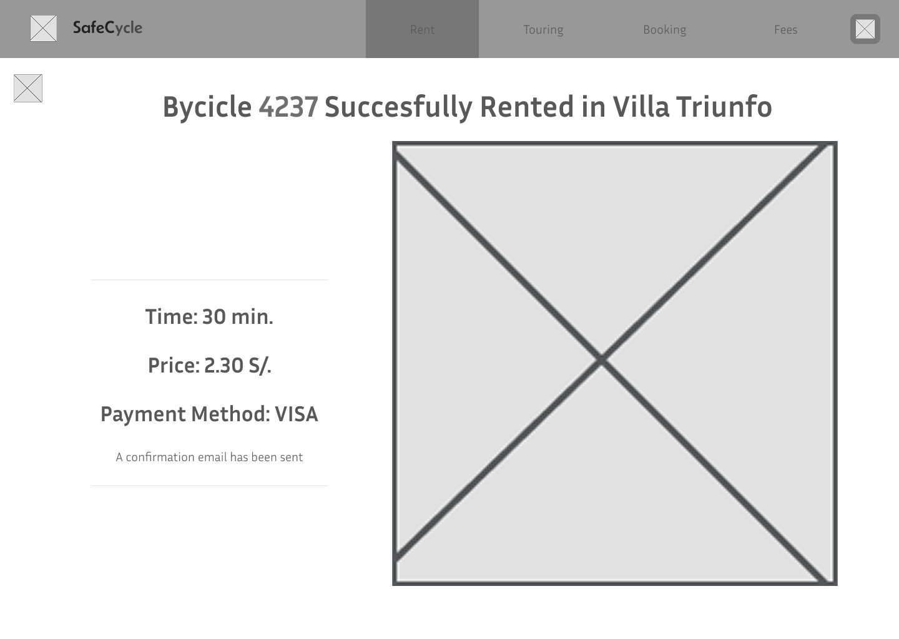

<h1 align="center">
  <strong style="font-size:25px;">Universidad Informe de Trabajo Final</strong>
</h1>

---

<strong>Universidad Peruana de Ciencias Aplicadas</strong>

  

Ingenieria de Software

5to ciclo

---

<strong>Código: </strong>1ASI0730

<strong>Curso:</strong> Aplicaciones Web

<strong>Sección:</strong> 4374

<strong>Docente:</strong> Alberto Wilmer Sanchez Seña

<strong>StartUp: </strong>Cuys TM

<strong>Proyecto:</strong> SafeCycle

## Integrantes:

| Nombres y Apellidos                  | Codigo     |
| ------------------------------------ | ---------- |
| Sanchez Gonzales                     | U202310609 |
| Mora Blas,  Diego Alonzo             | U20231c069 |
| Castañeda Guimas, Giancarlo Santiago | U202310601 |
| Gonzales Valverde, Carlos Matthew  | U202314130 |
| Jonseck Choque, Oliver | U202312912 |

Abril 2025

# Registro de Versiones del Informe

| Versión | Fecha | Autor | Descripción de modificación |
| :---- | :---- | :---- | :---- |
| 1.0 | 01/04/2025 | Sanchez, Mora, Castañeda, Jonseck, Gonzales | Creación del documento Markdown |
| 1.1 | 01/04/2025 | Castañeda | Redacción del startup profile y antecedentes y problemáticas. |
| 1.2 | 02/04/2025 | Sanchez, Mora | Redacción de Lean UX process y preguntas para el diseño de entrevistas |
| 1.3 | 03/04/2025 | Castañeda, Sanchez | Redacción de segmentos objetivos. Redacción de user personas y user task matrix. |

# Project Report Collaboration Insights

## **TP1**

Para el desarrollo de la TP1 nos hemos dividido como equipo diferentes tareas para cada seccion del informe.

| Integrante | Tareas Asignadas |
| :---- | :---- |
| Sanchez Gonzales | Lean UX Problem Statements, Lean UX Hypothesis Statements, Lean UX Canvas, Análisis competitivo, Diseño de entrevistas, User Personas, User Task Matrix, As-is Scenario Mapping, General Style Guidelines, Web Style Guidelines, Landing Page UI Design, Web Applications Wireframes, Web Applications Mock-ups, Web Applications User Flow Diagrams, Sprint Backlog 1, Video About-the-Product |
| Mora Blas, Diego Alonzo | Lean UX Assumptions, Análisis de entrevistas, Epics & User Stories, Impact Mapping, Searching Systems, Navigation Systems, Software Architecture Context Diagram, Software Architecture Components Diagrams, Class Diagrams, Class Dictionary, Aspect Leaders and Collaborators, Development Evidence for Sprint Review, Registro de Entrevista, Evaluaciones según heurísticas |
| Castañeda Guimas, Giancarlo Santiago | Descripción de la Startup, Segmentos objetivo, Registro de entrevistas, Ubiquitous Language, To-Be Scenario Mapping, Software Architecture Context Diagram, Software Development Environment Configuration, Sprint Planning 1 |
| Gonzales Valverde, Carlos Matthew	 | Estrategias y tácticas frente a competidores, Registro de entrevistas, User Journey Mapping, Product Backlog, SEO Tags and Meta Tags, Source Code Management, Software Deployment Configuration, Execution Evidence for Sprint Review. Services Documentation Evidence for Sprint Review, Software Deployment, Evidence for Sprint Review |
| Jonseck Choque, Oliver | Análisis de entrevistas, Empathy Mapping, Epics & User Stories, Organization Systems, Labeling Systems, Web Applications Wireflow Diagrams, Software Architecture Context Diagrams, Software Architecture Container Diagrams, Class Diagrams, Database Diagram, Source Code Style Guide & Conventions, Team Collaboration Insights during Sprint, Conclusiones, Recomendaciones |

# Tabla de contenidos

[Capítulo I: Introducción](#capítulo-i-introducción)
  - [1.1. Startup Profile](#11-startup-profile)
    - [1.1.1. Descripción de la Startup](#111-descripción-de-la-startup)
    - [1.1.2. Perfiles de integrantes del equipo](#112-perfiles-de-integrantes-del-equipo)
  - [1.2. Solution Profile](#12-solution-profile)
    - [1.2.1. Antecedentes y problemática](#121-antecedentes-y-problemática)
    - [1.2.2. Lean UX Process](#122-lean-ux-process)
      - [1.2.2.1. Lean UX Problem Statements](#1221-lean-ux-problem-statements)
      - [1.2.2.2. Lean UX Assumptions](#1222-lean-ux-assumptions)
      - [1.2.2.3. Lean UX Hypothesis Statements](#1223-lean-ux-hypothesis-statements)
      - [1.2.2.4. Lean UX Canvas](#1224-lean-ux-canvas)
  - [1.3. Segmentos objetivo](#13-segmentos-objetivo)

[Capítulo IV: Product Design](#capítulo-iv-product-design)
- [Registro de Versiones del Informe](#registro-de-versiones-del-informe)
- [Project Report Collaboration Insights](#project-report-collaboration-insights)
  - [**TP1**](#tp1)
- [Tabla de contenidos](#tabla-de-contenidos)
- [Student Outcome](#student-outcome)
- [Capítulo I: Introducción](#capítulo-i-introducción)
  - [1.1. Startup Profile](#11-startup-profile)
    - [1.1.1. Descripción de la Startup](#111-descripción-de-la-startup)
    - [1.1.2. Perfiles de integrantes del equipo](#112-perfiles-de-integrantes-del-equipo)
      - [1.1.2.1 Gabriel Sánchez Gonzales](#1121-gabriel-sánchez-gonzales)
      - [1.1.2.2 Giancarlo Santiago Castañeda Guimas](#1122-giancarlo-santiago-castañeda-guimas)
      - [1.1.2.3 Diego Alonzo Mora Blas](#1123-diego-alonzo-mora-blas)
      - [1.1.2.4 Gonzales Valverde Carlos Matthew](#1124-gonzales-valverde-carlos-matthew)
      - [1.1.2.5 Oliver Jonseck Choque](#1125-oliver-jonseck-choque)
  - [1.2. Solution Profile](#12-solution-profile)
    - [1.2.1. Antecedentes y problemática](#121-antecedentes-y-problemática)
    - [1.2.2. Lean UX Process](#122-lean-ux-process)
      - [1.2.2.1. Lean UX Problem Statements](#1221-lean-ux-problem-statements)
      - [1.2.2.2. Lean UX Assumptions](#1222-lean-ux-assumptions)
      - [1.2.2.3. Lean UX Hypothesis Statements](#1223-lean-ux-hypothesis-statements)
      - [1.2.2.4. Lean UX Canvas.](#1224-lean-ux-canvas)
  - [1.3 Segmentos objetivo.](#13-segmentos-objetivo)
    - [1.3.1 Segmento objetivo 1: Estudiantes pregrado](#131-segmento-objetivo-1-estudiantes-pregrado)
    - [1.3.2. Segmento Objetivo 2: Turistas](#132-segmento-objetivo-2-turistas)
- [Capítulo II: Requirements Elicitation \& Analysis](#capítulo-ii-requirements-elicitation--analysis)
  - [2.1 Competidores.](#21-competidores)
    - [2.1.1 Análisis competitivo.](#211-análisis-competitivo)
    - [2.1.2 Estrategias y tácticas frente a competidores](#212-estrategias-y-tácticas-frente-a-competidores)
  - [2.2 Entrevistas](#22-entrevistas)
    - [2.2.1 Diseño de entrevistas](#221-diseño-de-entrevistas)
    - [2.2.2 Registro de entrevistas.](#222-registro-de-entrevistas)
    - [2.2.3 Análisis de entrevistas.](#223-análisis-de-entrevistas)
  - [2.3 Needfinding](#23-needfinding)
  - [2.3.1 User Personas.](#231-user-personas)
    - [**Estudiante**:](#estudiante)
    - [**Turista**:](#turista)
  - [2.3.2 User Task Matrix.](#232-user-task-matrix)
    - [**Estudiantes**](#estudiantes)
    - [**Turistas**](#turistas)
  - [2.3.3 User Journey Mapping.](#233-user-journey-mapping)
  - [2.3.4 Empathy Mapping.](#234-empathy-mapping)
  - [2.3.5 As-is Scenario Mapping.](#235-as-is-scenario-mapping)
  - [2.4 Ubiquitous Language](#24-ubiquitous-language)
- [Capítulo IV: Product Design](#capítulo-iv-product-design)
  - [4.1. Style Guidelines](#41-style-guidelines)
    - [4.1.1. General Style Guidelines](#411-general-style-guidelines)
    - [4.1.1.1 Colores](#4111-colores)
    - [4.1.1.2 Tipografía](#4112-tipografía)
      - [4.1.1.2.1 Escala](#41121-escala)
      - [4.1.1.2.2 Weights](#41122-weights)
      - [4.1.1.2.3 Nomenclatura](#41123-nomenclatura)
      - [4.1.1.2.4 Ejemplos](#41124-ejemplos)
    - [4.1.1.3 Branding](#4113-branding)
      - [4.1.1.3.1 Claro:](#41131-claro)
      - [4.1.1.3.2 Oscuro:](#41132-oscuro)
    - [4.1.2 Web Style Guidelines](#412-web-style-guidelines)
      - [4.1.2.1 Estilos de letra](#4121-estilos-de-letra)
        - [4.1.2.1.1 Headings](#41211-headings)
        - [4.1.2.1.2 Captions](#41212-captions)
        - [4.1.2.1.3 Forms](#41213-forms)
        - [4.1.2.1.5 Buttons](#41215-buttons)
      - [4.1.2.2 Botones](#4122-botones)
      - [4.1.2.3 Caja de texto](#4123-caja-de-texto)
      - [4.1.2.4 Ventanas desplegables](#4124-ventanas-desplegables)
      - [4.1.2.5 Ventanas Emergentes](#4125-ventanas-emergentes)
  - [4.2. Information Architecture](#42-information-architecture)
    - [4.2.1. Organization Systems](#421-organization-systems)
    - [4.2.2. Labeling Systems](#422-labeling-systems)
    - [4.2.3. SEO Tags and Meta Tags](#423-seo-tags-and-meta-tags)
    - [4.2.4. Searching Systems](#424-searching-systems)
    - [4.2.5. Navigation Systems](#425-navigation-systems)
  - [4.3. Landing Page UI Design](#43-landing-page-ui-design)
    - [4.3.1. Landing Page Wireframe](#431-landing-page-wireframe)
    - [4.3.2. Landing Page Mock-up](#432-landing-page-mock-up)
  - [4.4. Web Applications UX/UI Design](#44-web-applications-uxui-design)
    - [4.4.1. Web Applications Wireframes](#441-web-applications-wireframes)
    - [4.4.2. Web Applications Wireflow Diagrams](#442-web-applications-wireflow-diagrams)
    - [4.4.3. Web Applications Mock-ups](#443-web-applications-mock-ups)
    - [4.4.4 Web Applications User Flow Diagrams](#444-web-applications-user-flow-diagrams)
  - [4.5. Web Applications Prototyping](#45-web-applications-prototyping)
  - [4.6. Domain-Driven Software Architecture](#46-domain-driven-software-architecture)
    - [4.6.1. Software Architecture Context Diagram](#461-software-architecture-context-diagram)
    - [4.6.2. Software Architecture Container Diagrams](#462-software-architecture-container-diagrams)
    - [4.6.3. Software Architecture Components Diagrams](#463-software-architecture-components-diagrams)
  - [4.7. Software Object-Oriented Design](#47-software-object-oriented-design)
    - [4.7.1. Class Diagrams](#471-class-diagrams)
    - [4.7.2. Class Dictionary](#472-class-dictionary)
  - [4.8. Database Design](#48-database-design)
    - [4.8.1. Database Diagram](#481-database-diagram)
  
# Student Outcome

| Criterio Especifico | Acciones Realizadas | Conclusiones |
| :---- | :---- | :---- |
| Trabaja en equipo para proporcionar liderazgo en forma conjunta | **Sanchez Gonzales: *TB1*** Dentro de esta entrega me enfoque en avanzar con La redacción del Lean UX Problem Statements, Hypothesis Statements y Canvas. También desarrolle preguntas para el diseño de entrevistas, los user personas y user task matrix. Finalmente, Realice el análisis competitivo, diseño de entrevistas y As-is Scenario Mapping, Style Guidelines, Landing Page UI Design y Web Applications UX/UI Design   **Giancarlo Santiago:*TB1*** ...| Como equipo logramos tener un liderazgo de forma conjunto, puesto que, siempre discutimos acerca de las ideas con el fin de encontrar la mejor solución viable. Todos colaboramos en dar nuestras opiniones e ideas, logrando así un trabajo en conjunto exitoso. |
| Crea un entorno colaborativo e inclusivo, establece metas, planifica tareas y cumple objetivos. | **Sanchez Gonzales: *TB1*** Dentro de esta entrega me enfoque en avanzar con La redacción del Lean UX Problem Statements, Hypothesis Statements y Canvas. También desarrolle preguntas para el diseño de entrevistas, los user personas y user task matrix. Finalmente, Realice el análisis competitivo, diseño de entrevistas y As-is Scenario Mapping, Style Guidelines, Landing Page UI Design y Web Applications UX/UI Design   **Giancarlo Santiago:*TB1*** ...| Como equipo logramos establecernos metas y tareas, creemos que al autoimponerse fechas para terminar de realizar ciertas secciones dentro del capítulo, nos ayudó a planificar y avanzar en conjunto. |

# Capítulo I: Introducción

## 1.1. Startup Profile
Nuestra Startup “Cuys ™” ofrece una aplicación innovadora de préstamos de bicicletas “Safecycle” enfocadas a ayudar a estudiantes y turistas brindando una alternativa sostenible, accesible y segura para llegar a su destino. Ofrecemos una solución independiente al ofrecer las bicicletas como producto principal y contaremos con un modelo de negocio basado en los pagos que se realizarán en la aplicación por el préstamo de las bicicletas. Para ello investigaremos cómo cumplir con esta meta recolectando fuentes sobre modelos de negocios similares y planificamos el diseño y la codificación de nuestra solución.

### 1.1.1. Descripción de la Startup

### 1.1.2. Perfiles de integrantes del equipo

#### 1.1.2.1 Gabriel Sánchez Gonzales

Soy estudiante en la Universidad Peruana de Ciencias Aplicadas (UPC) cursando el 5to ciclo de la carrera de Ingeniería de Software. Soy una persona comprometida con mi desarrollo académico y profesional. Con esa responsabilidad, aspiro a proveer soluciones tecnológicas a aquellos que las requieran para facilitar su área de trabajo. Junto con mi equipo de trabajo tendré la oportunidad de poner mis conocimientos y habilidades en uso con el proyecto “Safecycle” con el fin de disminuir la problemática identificada. 

#### 1.1.2.2 Giancarlo Santiago Castañeda Guimas
Estudiante de la carrera de ingeniería de software en la Universidad Peruana de Ciencias Aplicadas cursando el 5to ciclo. Me considero una persona activa y que siempre busca terminar las cosas bien y de ser posible rápidamente. También me gusta la responsabilidad y el buen ambiente entre mis compañeros de grupo. 

#### 1.1.2.3 Diego Alonzo Mora Blas
Estudiante de la carrera de ingeniería de software en la UPC, cuento con habilidades como el aprendizaje rápido el cual me ha llevado a practicar y conocer diversas áreas como lo son la programación, la ciberseguridad y redes. Tengo el honor de trabajar con mi equipo el cual estoy seguro que nos aseguraremos de presentar un trabajo al nivel.

#### 1.1.2.4 Gonzales Valverde Carlos Matthew
Estudiante de la carrera de ingeniería de software en la Universidad Peruana de Ciencias Aplicadas, me destaco en poder trabajar bajo a presion, tener una
escucha activa y apoyar a mis compañeros cuando mas lo necesiten, esto tambien me ayudo a explorar mas el mundo de la programacion y ahora la ciberseguridad
que quiero especializarme en ello. Agradezco a todo el grupo porque tenemos un ambiente adecuado y estoy seguro que podremos presentar un excelente trabajo.

#### 1.1.2.5 Oliver Jonseck Choque
Estudiante de Ingeniería de Software en la Universidad Peruana de Ciencias Aplicadas, actualmente en el quinto ciclo. Me destaco por ser proactivo y enfocado en cumplir con mis responsabilidades de manera eficiente. Valoro el trabajo bien hecho y disfruto colaborar en entornos donde reina el respeto y la buena comunicación entre compañeros.

## 1.2. Solution Profile

### 1.2.1. Antecedentes y problemática
1\. **What:** ¿Qué queremos ofrecer?

Queremos ofrecer un servicio de alquiler de bicicletas, estas se pueden alquilar durante un periodo de tiempo dictaminado por una aplicación, esta se trata de una aplicación web que se puede acceder por computadora y/o celular.

2\.      **Who:** ¿A quiénes queremos brindar nuestros servicios?

Queremos brindar nuestros servicios a estudiantes que requieren de un medio barato y rápido y turistas que necesitan de un transporte barato o uno que puedan utilizar durante un corto periodo de tiempo.

3\.      **Where:** ¿Dónde se pueden recoger las bicicletas?

Las bicicletas se pueden recoger de lugares específicos, estos se llamarán almacenes. Se encontrarán en diversas posiciones estratégicas alrededor de Lima metropolitana.

4\.      **When:** ¿Cuándo se tienen que devolver las bicicletas?

Esto se decide una vez se alquila la bicicleta, el cliente podrá decidir durante cuántas horas va a alquilar la bicicleta, esto afectará el precio. Al final el cliente tendrá que devolver la bicicleta hacia la estación más cercana.

5\.      **Why:** ¿Por qué el cliente usaría nuestros servicios?

El cliente utiliza nuestros servicios, porque necesita transportarse rápido y barato.

6\.      **How:** ¿Cómo conseguimos que los clientes devuelvan las bicicletas a tiempo?

Una vez se decida la cantidad de horas la cantidad de horas por las que se va a alquilar la bici, si la hora establecida es excedida el cliente tendrá que pagar una mora por cada hora/minuto que se exceda.

7\.      **How much:** ¿Cuánto tiempo se les permitirá a los clientes alquilar una bicicleta?

Se les permitirá alquilar un mínimo de 1 hora y un máximo de 24 horas, dependiendo del tipo de usuario. Además, se pueden alquilar las bicicletas con antelación mediante una reserva.

### 1.2.2. Lean UX Process

#### 1.2.2.1. Lean UX Problem Statements
Nuestra solución busca proveer un aplicativo que conecte a los estudiantes y turistas que no tengan un método de traslado fijo  con un medio de transporte eco amigable, rápido y accesible, como lo es la bicicleta, con el fin de que puedan desplazarse de un lugar a otro a través de esta misma. Asimismo, al garantizar la seguridad de los usuarios de estas bicicletas a través de bloqueos en casos un uso excesivo o por bloqueo del propio rentador, evitamos posibles robos y mal usos de las bicicletas.
Hemos observado que al no tener un transporte fijo tanto los estudiantes como turistas no pueden llegar a sus destinos propuestos a tiempo. El tráfico en Lima metropolitana y el acumulamiento de gente dentro de servicios de transporte público hacen la tarea de desplazamiento casi imposible, y tanto los estudiantes como los turistas no tienen una necesidad para comprarse un transporte personal para poder movilizarse. 
¿Cómo podemos ofrecer un transporte fiable y organizado, que los ayude a llegar a su destino?
Notamos que los estudiantes y turistas no desean pagar por un medio de transporte como son los taxis, puesto que las tarifas pueden llegar a exceder su presupuesto, pero tampoco se sienten cómodos al usar el transporte público, pues este es muy incomodo o los deja con mucha caminata hacia su destino final lo que termina generando una pérdida de tiempo. Esto repercusiona en que no pueden llegar a los destinos que desean a tiempo y terminan gastando más tiempo en el recorrido que en el propio lugar.
¿Cómo puede nuestra plataforma proveer a nuestro público con una manera más eficiente de transporte y movilización?

#### 1.2.2.2. Lean UX Assumptions

Creemos que los estudiantes y turistas en Lima enfrentan una falta de transporte fiable y económico, lo que genera retrasos e incomodidad, al ofrecer bicicletas accesibles mediante una app, creemos firmemente que  resolveremos esta necesidad. Nuestros segmentos objetivos priorizan el ahorro, prefiriendo nuestro servicio frente a taxis o transporte público costoso,además percibirán las bicicletas como una opción más cómoda al evitar el tráfico.La seguridad será clave, por lo que el sistema de bloqueo automático reducirá el miedo a robos, aumentando la confianza. Asumimos que la app será adoptada fácilmente ya que es intuitiva y garantiza transacciones seguras. Validamos estas suposiciones mediante encuestas de satisfacción, análisis de datos de uso, comparación de costos, entrevistas sobre seguridad y monitoreo de la reducción de congestión en zonas clave.

#### 1.2.2.3. Lean UX Hypothesis Statements
Creemos que la eficacia con la que se movilizan los estudiantes y turistas aumentaría en un 80% debido a que se les proporcionará con una herramienta de transporte de acceso libre , como son las bicicletas, a través de un pago mínimo. Sabremos que estamos en lo correcto cuando se visualice un aumento de puntualidad hacia ciertos eventos.
Creemos que los estudiantes y turistas podrán viajar más cómodamente hacia sus destinos, proporcionándoles una mejor experiencia en general. Sabremos que estamos en lo correcto cuando a través de encuestas a usuarios se menciona seguidamente que la comodidad de sus viajes ha mejorado, concluyendo con más de un 70% de aprobación en cuanto a comodidad.
Creemos que nuestro servicio será 30% más económico que otros medios de transporte de la ciudad para los estudiantes y turistas. Sabremos que estamos en lo correcto al comparar la media de dinero que gastaban antes los usuarios en comparación con lo que gastan usando nuestro servicio.
Creemos que la implementación de este sistema de préstamo de bicicletas puede reducir hasta un 20% la congestión vehicular que se presencia en zonas de rutas universitarias y rutas turísticas. Sabremos que estamos en lo correcto cuando se visualice un cambio en las paradas de transporte público, mostrando que más personas pueden entrar en los buses y menos personas recurren a los taxis.
Creemos que los usuarios se sentirán más seguros usando las bicicletas sabiendo que estas tienen un sistema de bloqueo automático que solo se activa solo cuando el tiempo de préstamo se sobrepasa o si la bicicleta es reportada como robada. Sabremos que estamos en lo correcto a través de entrevistas a los usuarios acerca de la confianza que le tienen a las bicicletas.

#### 1.2.2.4. Lean UX Canvas.

| Business Problem | Solution Ideas | Business Outcomes |
| :---- | :---- | :---- |
| Nuestra solución busca proveer un aplicativo que conecte a los estudiantes y turistas que no tengan un método de traslado fijo  con un medio de transporte eco amigable, rápido y accesible, como lo es la bicicleta, con el fin de que puedan desplazarse de un lugar a otro a través de esta misma. Asimismo, al garantizar la seguridad de los usuarios de estas bicicletas a través de bloqueos en casos un uso excesivo o por bloqueo del propio rentador, evitamos posibles robos y mal usos de las bicicletas. Hemos observado que al no tener un transporte fijo tanto los estudiantes como turistas no pueden llegar a sus destinos propuestos a tiempo. El tráfico en Lima metropolitana y el acumulamiento de gente dentro de servicios de transporte público hacen la tarea de desplazamiento casi imposible. Además, tanto los estudiantes como los turistas no tienen la necesidad de comprarse un transporte personal para poder movilizarse.  ¿Cómo podemos ofrecer un transporte fiable y organizado, que los ayude a llegar a su destino? Notamos que los estudiantes y turistas no desean pagar por un medio de transporte como son los taxis, puesto que las tarifas pueden llegar a exceder su presupuesto, pero tampoco se sienten cómodos al usar el transporte público, pues este es muy incomodo o los deja aun con mucha caminata hacia su destino, generando una pérdida de tiempo. Esto repercusiona en que no pueden llegar a los destinos que desean de forma puntual y terminan gastando más tiempo en el recorrido que en el propio lugar. ¿Cómo puede nuestra plataforma proveer a nuestro público con una manera más eficiente de transporte y movilización? | Brindar un préstamo de bicicleta para que los estudiantes o turistas puedan movilizarse por un costo. Integrar un sistema de bloqueo automático para evitar un mal uso de las bicicletas. Contar con un sistema de recojo y devolución a través de diferentes estaciones | Los estudiantes usarán más nuestra plataforma que el transporte público habitual en un 30%. Control adecuado a las bicicletas gracias a su sistema de seguridad, reduciendo en un 20% de probabilidades de mal uso Retención de usuarios en un 50% después del primer mes Aumento de visibilidad de la plataforma en un 40% por los usuarios que la comparten |
| Hypothesis | Users & Customers | User Benefits |
| Creemos que la eficacia con la que se movilizan los estudiantes y turistas aumentaría en un 80% debido a que se les proporcionará con una herramienta de transporte de acceso libre, como son las bicicletas, a través de un pago mínimo. Sabremos que estamos en lo correcto cuando se visualice un aumento de puntualidad hacia ciertos eventos. Creemos que los estudiantes y turistas podrán viajar más cómodamente hacia sus destinos, proporcionándoles una mejor experiencia en general. Sabremos que estamos en lo correcto cuando a través de encuestas a usuarios se menciona seguidamente que la comodidad de sus viajes ha mejorado, concluyendo con más de un 70% de aprobación en cuanto a comodidad. Creemos que nuestro servicio será 30% más económico que otros medios de transporte de la ciudad para los estudiantes y turistas. Sabremos que estamos en lo correcto al comparar la media de dinero que gastaban antes los usuarios en comparación con lo que gastan usando nuestro servicio. Creemos que la implementación de este sistema de préstamo de bicicletas puede reducir hasta un 20% la congestión vehicular que se presencia en zonas de rutas universitarias y rutas turísticas. Sabremos que estamos en lo correcto cuando se visualice un cambio en las paradas de transporte público, mostrando que más personas pueden entrar en los buses y menos personas recurren a los taxis. Creemos que los usuarios se sentirán más seguros usando las bicicletas sabiendo que estas tienen un sistema de bloqueo automático que solo se activa solo cuando el tiempo de préstamo se sobrepasa o si la bicicleta es reportada como robada. Sabremos que estamos en lo correcto a través de entrevistas a los usuarios acerca de la confianza que le tienen a las bicicletas. | Estudiantes universitarios de pregrado que deseen llegar a su destino rápidamente y evitar el tráfico. Turistas que requieran un transporte personal temporal sin la necesidad de rentar un automóvil. | Tener acceso a un transporte personal económico, amigable con el medio ambiente y disponible en cualquier momento Movilizarse rápida y eficazmente alrededor de la ciudad. Llegar más puntuales a diferentes eventos o lugares, proporcionando un mayor tiempo en el lugar y menos tiempo de movilización. Reducir sus gastos de transporte gracias a su precio accesible. Contribuir a una mejora en el medio ambiente al usar un medio de transporte ecoamigable  |
|  | What’s the most important thing we need to learn first?  | What’s the least amount of work we need to learn the next most important thing?    |
|  | Determinar si los estudiantes y turistas están dispuestos a pagar por el servicio propuesto. Verificar que los usuarios de estas bicicletas no les den un mal uso a las mismas. | Diseñar entrevista con preguntas concretas a una estadística Desplegar una versión de prueba con pocas bicicletas en puntos estratégicos para detectar posibles problemas iniciales |

## 1.3 Segmentos objetivo.
### 1.3.1 Segmento objetivo 1: Estudiantes pregrado
**Descripción:** 
Los estudiantes tienen una vida agitada, una rutina dinámica y ajustada a horarios específicos. Por las mañanas muchos deben desplazarse desde sus residencias hacia sus centros de educación en poco tiempo, además del agobiante tráfico y algunos teniendo que lidiar con el transporte público.
**Caracteristicas:**
- Edad: 18 a 30 años 
- Ubicación: Zonas urbanas, suelen vivir cerca de sus centros de educación 
- Nivel socioeconomico: Clase Media	    
### 1.3.2. Segmento Objetivo 2: Turistas
**Descripción:** 
Los turistas buscan maximizar su tiempo explorando nuevas partes de la ciudad de una manera cómoda y accesible, ya sean centros turísticos como museos, atracciones o centros históricos. Para ello requiere gastar e invertir un buen capital, además considerando el tráfico en el Perú esto no puede ser tanto del agrado del turista. 
**Caracteristicas:**
- Edad: 18 a 50 años 
- Ubicación: Zonas urbanas con alto índice de turismo, puntos de intereses históricos o culturales
- Nivel socioeconomico: Clase Media - Alta

# Capítulo II: Requirements Elicitation & Analysis
## 2.1 Competidores.
### 2.1.1 Análisis competitivo.

| **Competitive Analysis Landscape** | **Escriba en el recuadro la pregunta que busca responder o el objetivo de este análisis.** |
| :---- | :---- |
| ¿Por qué llevar a cabo este análisis?  | Deseamos analizar a nuestros competidores para buscar en qué puntos podemos mejorar, contra que nos estamos enfrentando en el mercado y como nos distinguimos de estos |

|  |  |   Safecycle |  CityBikeLima |  Barrancobikes |  Mirabiciperu |
| :---- | :---- | ----- | :---- | :---- | :---- |
| Perfil | Overview Ventaja competitiva  | Plataforma direccionada hacia la renta por minuto de las bicicletas, las cuales se pueden reservar desde la aplicación y posteriormente. | Servicio presencial en el cual se rentan bicicletas por un tiempo de 30 minutos gratis a través de pases mensuales, anuales o diarios y pagados por la pantalla de la bicicleta. | Una plataforma en la que puedes pagar por una bicicleta por horas, días o semanas alrededor de Barranco | Plataforma que ofrece una reservas de bicicletas a través de rutas turísticas |
|  | ¿Qué valor ofrece a los clientes? | • Devolución de bicicletas en cualquier estación.  • Cobro por minuto.  • Seguro automatico.  • Paquetes de descuento a estudiantes  • Planes por horas | • Tarjeta con pases anuales  • Desbloqueo de bicicleta con código o tarjeta  • Devolución de bicicletas en cualquier estación.  • Servicio de pausa de la bicicleta | • Renta de bicicletas por horas, días y semanas  • Proporciona elementos de seguridad Delivery de bicicleta | • 3 rutas de turismo   • Ofrece una renta de bicicleta por duración de tour  |
| Perfil de Marketing | Mercado objetivo  | • Estudiantes de pregrado Turistas | • Residentes de San Isidro | • Residentes de Barranco Turistas | • Turistas |
|  | Estrategias de marketing | • Códigos de referencia por parte de otros usuarios para descuentos  • Descuentos hacia los estudiantes  • Tutoriales acerca de uso | • Registro a través de pases y tarjetas 30 primeros minutos gratis  • Tutoriales acerca de uso | • Añade un descuento de consumo a un restaurante afiliado | • Tours en grupo  • Opiniones de otros usuario en la misma página web |
| Perfil de Producto | • Productos & Servicios  | • Renta de Bicicleta | • Tarjeta de pago para bici  • Renta de Bicicleta | • Casco y cadena incluido con la renta  • Renta de Bicicleta | • Tours en zonas culturales, con explicación en bicicleta  • Servicios técnico y de repuesto |
|  | Precios & Costos  | • **Estudiantes:**  S/. 0.035 / minuto  • **Tarifa General:**  S/. 0.045 / minuto  • **Tarifa Inicial:**  S/. 1.00 / minuto | • **Minuto 0 al 30:** Sin costo  •**31 al 120:**  S/ 2.00 cada 30 minutos o fracción  • **121 a más:**  S/ 7.00 cada hora o fracción | • **02 horas:**  S/. 25.00  • **03 horas:**  S/ 30.00  • **05 horas:**  S/ 45.00  • **Más de 05 horas:**  S/ 55.00 | • **Ruta 1:** USD 35 S/. 133  • **Ruta 2:** USD 25 S/. 95  • **Ruta 3:** USD 35 S/. 133 |
|  | Canales de distribución (Web y/o Móvil)  | Web y Móvil | Presencial Web y Móvil | Web | Web |
| Análisis SWOT | Fortalezas | • Tarifa accessible Adaptable a otros dispositivos | Diferentes formas de renta  • Prueba gratuita para atraer clientes  •  Tarifa accessible | • Delivery a la puerta de tu casa  • Elementos extra proporcionados  | • Tours con guia turistico.  • Función para rentar en grupo |
|  | Debilidades | • Dependencia a internet Dependencia a disponibilidad  • Riesgo de vandalismo  • Bajo conocimiento de marca inicial. | • Riesgo de vandalismo  • Dificultad de uso para personas sin mucho conocimiento tecnológico  • Reubicación de bicicletas por congestión | • Dependencia a disponibilidad Bajo conocimiento de marca inicial. | • Dependencia a disponibilidad  • Falta de confianza de usuario |
|  | Oportunidades | • Alianzas con centros educativos o cadenas de turismo Subvención gubernamental por negocio eco-friendly  • Incorporar nuevos tipos de transporte | • Incorporar nuevos tipos de transporte  • Expansión de distritos disponibles | • Expansión de distritos disponibles | • Mayor cantidad de tours disponibles  • Alianza con hoteles |
|  | Amenazas | • Competencia en el mercado alta • Robo o hackeos | • Problemas por clima o infraestructura | • Quejas por demora de renta | • Cambios de normativas de rutas  • Poca retención de usuarios |

### 2.1.2 Estrategias y tácticas frente a competidores
## 2.2 Entrevistas
### 2.2.1 Diseño de entrevistas
Como se mencionó anteriormente, nuestros segmentos objetivos están conformados por estudiantes universitarios de pregrado, principalmente aquellos que viven en cercanías de la universidad y turistas.

Después de solicitarles sus datos personales básicos como nombres, apellidos, edad y distrito de estadía, se les preguntará lo siguiente a los entrevistados.

**Preguntas a realizar:**

**Generales:**

¿Cuál es tu nombre y apellidos?

¿Cuántos años tienes?

¿Cuál es tu lugar de nacimiento?

**Estudiantes:**

- ¿Cómo te transportas habitualmente en tu día a día?

- ¿Cuánto tiempo te demora normalmente para llegar a tu destino?

- ¿Has usado bicicletas anteriormente como medio de transporte antes? ¿Cuál fue la razón?

- ¿Cuáles son las principales dificultades que enfrentas al moverte alrededor de la ciudad?

- ¿Qué tan cómodo es ir en el transporte que usas actualmente para llegar a tu destino?

- En una escala del 1 al 5, ¿Qué tan dispuesto estarías a usar un servicio de préstamo de bicicletas?

- ¿Cuanto estas pagando actualmente en tus servicios de transporte semanalmente?

- ¿Cuánto estarías dispuesto a pagar por un servicio de alquiler de bicicletas?

- ¿Te sentirías más seguro y confiado acerca del sistema sabiendo que la bicicleta se bloquea automáticamente si excedes el tiempo del préstamo o se detecta como robada?

- ¿Has usado anteriormente algún servicio de préstamo de bicicletas? ¿Qué te llamó la atención y que no?

**Turistas:**

- ¿Cómo te transportas habitualmente en tu estadía?

- ¿Cuánto tiempo te demora normalmente para llegar a tu destino?

- ¿Has usado bicicletas anteriormente como medio de transporte antes? ¿Cuál fue la razón?

- ¿Cuáles son las principales dificultades que enfrentas al moverte alrededor de la ciudad?

- ¿Qué tan cómodo es ir en el transporte que usas actualmente para llegar a tu destino?

- En una escala del 1 al 5, ¿Qué tan dispuesto estarías a usar un servicio de préstamo de bicicletas?

- ¿Cuanto estas pagando actualmente en tus servicios de transporte semanalmente?

- ¿Cuánto estarías dispuesto a pagar por un servicio de alquiler de bicicletas?

- ¿Te sentirías más seguro y confiado acerca del sistema sabiendo que la bicicleta se bloquea automáticamente si excedes el tiempo del préstamo o se detecta como robada?

- ¿Has usado anteriormente algún servicio de préstamo de bicicletas? ¿Qué te llamó la atención y que no?
### 2.2.2 Registro de entrevistas.
### 2.2.3 Análisis de entrevistas.
## 2.3 Needfinding
## 2.3.1 User Personas.
### **Estudiante**: 
.png)
[Link a UXpresia de Anne Guillen](https://uxpressia.com/w/2JtXc/p/tbFfu)
 
### **Turista**: 

[Link a UXpresia de Mateo Smith](https://uxpressia.com/w/2JtXc/p/Wfgtx)
## 2.3.2 User Task Matrix.
### **Estudiantes**

| Actividades | Frecuencia | Importancia |
| ----- | ----- | ----- |
| Buscar entre opciones de transporte accesibles y económicas al bolsillo | Media | Alta |
| Determinar el tiempo que tomará el viaje hacia su destino | Alta | Alta |
| Planificar el costo del viaje a realizar | Media | Alta |
| Ajustar horarios para llegar puntualmente a los eventos | Alta | Alta |
| Evaluar si usar un transporte público o invertir en un taxi | Baja | Media |

### **Turistas**

| Actividades | Frecuencia | Importancia |
| ----- | ----- | ----- |
| Buscar entre opciones de transporte accesibles y económicas al bolsillo | Media | Alta |
| Determinar el tiempo que tomará el viaje hacia su destino | Alta | Alta |
| Planificar el costo del viaje a realizar | Media | Alta |
| Ajustar horarios para llegar puntualmente a los eventos | Alta | Alta |
| Evaluar si usar un transporte público o invertir en un taxi | Baja | Media |
| Programar visitas y turismo evitando las horas más congestionadas del tráfico | Baja | Media |
## 2.3.3 User Journey Mapping.
## 2.3.4 Empathy Mapping.
## 2.3.5 As-is Scenario Mapping.
## 2.4 Ubiquitous Language

# Capítulo IV: Product Design
## 4.1. Style Guidelines
### 4.1.1. General Style Guidelines

### 4.1.1.1 Colores

   Para SafeCycle hemos escogido una paleta de colores que cuenta con una variación de tonalidades de verdes que se oponen a comparación del azul, blanco grisáceo y naranja agregados para brindar contraste y hacer totalmente visibles los elementos incluidos. Optamos por escoger los colores verdes y azul como base dado el significado que estos poseen y lo que transmiten. En el caso del primero y principal, el verde se ve relacionado con la naturaleza, sabiendo que nosotros nos enfocamos en las bicicletas, lo cual es un medio de transporte amigable con el medio ambiente, queremos reflejar esa acción por la naturaleza a través de este color. Por otro lado, el azul se encuentra relacionado con la confianza, puesto que queremos que nuestros usuarios se sientan confiados en esta plataforma, el rol que cumple es muy importante. Consideramos que estos dos colores son ideales para mostrar en primer plano el mensaje de sinceridad y entorno eco-amigable que deseamos brindar.

### 4.1.1.2 Tipografía

La fuente que estamos empleando para el texto es Inria Sans. Esta cuenta con un aspecto limpio. Asimismo, consideramos que su diseño amigable a la vista logrará que los usuarios puedan leer cada uno de los textos incluídos en la página y aplicación sin dificultades. Para lograr un mejor diseño ajustaremos el tamaño, grosor y color dependiendo del caso en que se utilice.

#### 4.1.1.2.1 Escala

#### 4.1.1.2.2 Weights

#### 4.1.1.2.3 Nomenclatura

#### 4.1.1.2.4 Ejemplos

               
### 4.1.1.3 Branding

Para el logo que representará a la plataforma optamos por utilizar su característico color verde y un fondo en blanco para generar su contraste.
  

Para asegurar que nuestro logo sea visible en cualquier situación, adecuamos el logo para que sea visible tanto en un fondo oscuro como claro.

#### 4.1.1.3.1 Claro:

         
         

#### 4.1.1.3.2 Oscuro:

         
       

### 4.1.2 Web Style Guidelines

Para nuestro diseño de página web, estaremos utilizando la misma paleta de colores característicos de SafeCycle. Además, a través de las formas que usaremos para las ventanas emergentes o botones, se notará el uso de formas redondeadas. Además utilizaremos variaciones de tamaño para evitar sobrecargar la pantalla y tener un espacio en blanco para brindar un descanso visual al usuario. De esta forma, lograremos tener un estilo que sea fácil de leer y atractivo para que cualquier usuario pueda adaptarse rápidamente a este.
Paleta de colores

#### 4.1.2.1 Estilos de letra
##### 4.1.2.1.1 Headings
   

##### 4.1.2.1.2 Captions

   

##### 4.1.2.1.3 Forms
   

##### 4.1.2.1.5 Buttons

   

#### 4.1.2.2 Botones

   
   

#### 4.1.2.3 Caja de texto

  
 

#### 4.1.2.4 Ventanas desplegables
  
  

#### 4.1.2.5 Ventanas Emergentes

    

## 4.2. Information Architecture
### 4.2.1. Organization Systems
### 4.2.2. Labeling Systems
### 4.2.3. SEO Tags and Meta Tags
### 4.2.4. Searching Systems

Las funcionalidades de búsqueda en SafeCycle están diseñadas para simplificar el acceso a estaciones, tarifas, rutas y servicios turísticos, permitiendo al usuario encontrar rápidamente lo que necesita sin sentirse abrumado.

## Entrada Manual de Estación
- **Campo de búsqueda por nombre de estación**
Los usuarios pueden ingresar manualmente el nombre de la estación de bicicletas en un campo de texto identificado como "Station". Esto permite realizar búsquedas precisas cuando ya se conoce el punto de partida deseado.

Una vez ingresado el nombre de la estación, el usuario puede hacer clic en el botón verde "Calculate" para obtener datos como disponibilidad, tiempo estimado de alquiler o rutas sugeridas desde esa ubicación.

Este componente permite una experiencia de búsqueda directa, ideal para usuarios que ya conocen su estación preferida o desean consultar opciones desde un punto específico.

### 4.2.5. Navigation Systems

La estructura de navegación de SafeCycle está diseñada para facilitar el acceso rápido y fluido a todas las funcionalidades clave, optimizando la experiencia tanto para nuevos visitantes como para usuarios recurrentes.

#### Páginas Principales
- **Landing Page**: Introducción al servicio y sus beneficios.
- **About Us**: Información sobre el propósito y visión de SafeCycle.
- **Contact**: Formulario de contacto y canales de comunicación.
- **Plans & Pricing**: Tarifas diferenciadas para estudiantes y turistas.
- **Touristic Routes**: Acceso a recorridos turísticos disponibles.

#### Opciones de Usuario
- **Login**: Acceso para usuarios registrados.
- **Sign Up**: Registro de nuevos usuarios (estudiantes o turistas).
- **Profile**: Acceso a información personal, reservas y pagos.
- **Logout**: Cierre de sesión para mantener la seguridad.

#### Búsqueda y Navegación
- **Search**: Barra de búsqueda de estaciones, tarifas y rutas.
- **Stations Nearby**: Visualización rápida de estaciones más cercanas.
- **Explore Tours**: Explora las rutas turísticas destacadas.
- **My Rentals**: Historial y estado de alquileres o reservas activas.

#### Branding e Identidad
- **SafeCycle Logo**: Presente en la esquina superior izquierda de cada pantalla.
- **Slogan**: “Viaja seguro, llega puntual”, visible en la página principal.
- **Color Theme**: Identidad visual consistente en verde, blanco y azul.
- **Language Toggle**: Selector de idioma (EN/ES) en el footer y perfil.

## 4.3. Landing Page UI Design
### 4.3.1. Landing Page Wireframe

### 4.3.2. Landing Page Mock-up

## 4.4. Web Applications UX/UI Design
### 4.4.1. Web Applications Wireframes

### 4.4.2. Web Applications Wireflow Diagrams

[link a wireflow diagrams](https://lucid.app/lucidchart/007fe905-b01c-4089-9f21-90863b26fd98/edit?invitationId=inv_2f936f9b-5515-424e-93a7-8ea7595ce4e6)

### 4.4.3. Web Applications Mock-ups

### 4.4.4 Web Applications User Flow Diagrams 

[link a user flow diagrams](https://lucid.app/lucidchart/3d73b82d-4c20-4e09-afa9-4c03fc615e97/edit?invitationId=inv_dede9743-a201-4f73-9f0d-7a9a8f3cedb4)

## 4.5. Web Applications Prototyping

[link a prototype](https://www.figma.com/proto/XUOywJac5xiviLZTzQRXVC/Aplicaciones-Web---SafeCycle?node-id=2362-1253&p=f&t=lIyIwAwyr9eGUpbR-1&scaling=scale-down&content-scaling=responsive&page-id=13%3A501&starting-point-node-id=2362%3A1866&show-proto-sidebar=1)

## 4.6. Domain-Driven Software Architecture
### 4.6.1. Software Architecture Context Diagram
### 4.6.2. Software Architecture Container Diagrams
### 4.6.3. Software Architecture Components Diagrams
## 4.7. Software Object-Oriented Design
### 4.7.1. Class Diagrams
### 4.7.2. Class Dictionary
## 4.8. Database Design
### 4.8.1. Database Diagram
